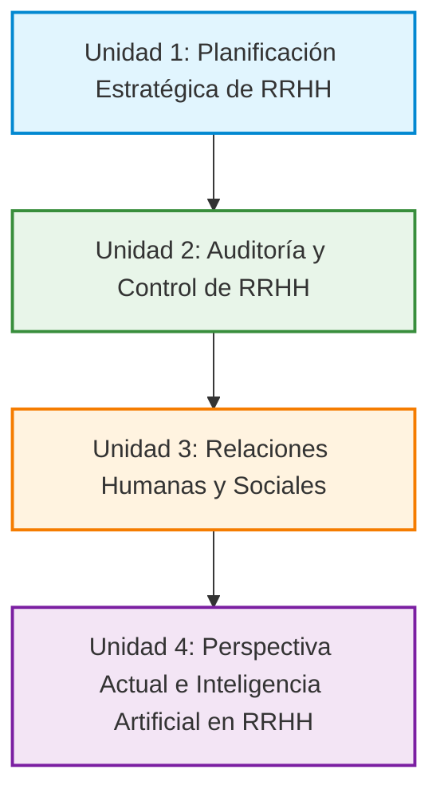

# 👔 Gestión de Recursos Humanos III

## Programa General de la Materia — Resumen de las 4 Unidades y Autores

Este documento sintetiza la estructura pedagógica y temática oficial de la cátedra **Gestión de Recursos Humanos III (2025)**, vinculando los contenidos teóricos con las discusiones y debates abordados en las clases y desgrabaciones.

---

## 📌 Mapa General de Unidades

---

## 🏛️ Unidad 1: Planificación Estratégica de Recursos Humanos

### 🎯 Eje Temático

Aborda la planificación estratégica como una herramienta central en el marco de la **gestión orientada a resultados**. Desarrolla la definición e integración entre la **misión, visión, estrategia, objetivos estratégicos e indicadores de desempeño**. Analiza la vinculación indispensable entre la **Planificación Estratégica Institucional (PEE)** y la **Planificación Operativa y de Recursos Humanos (PERRHH)**.

Examina los diferentes enfoques de planeamiento (estratégico institucional, tradicional y normativo), la conceptualización de **situación y problema**, y las fases del proceso de planificación de RRHH (fines, importancia, etapas, factores condicionantes, tendencias y evaluación). Finalmente, profundiza en las metodologías cualitativas y cuantitativas para identificar necesidades de personal, el uso del **análisis FODA** y la consolidación del plan de recursos humanos como motor de competitividad y sostenibilidad.

### 📚 Autores y Bibliografía Obligatoria

1. **Marianela Armijo (CEPAL, 2009)**: *Manual de Planificación estratégica e indicadores de desempeño en el sector público*.
2. **Alfredo Ossorio (FLACSO, 2003)**: *Planeamiento estratégico*.
3. **Luis Carlos Palacios Acero**: *Dirección estratégica* (2ª Edición).
4. **Martín Iglesias, Cecilia Pagola y Washington Uranga (UNLP, 2012)**: *Enfoques de planificación*.
5. **Simón Dolan y otros (1999)**: *La Gestión de los Recursos Humanos* (Capítulo 3: Planificación de los recursos humanos).
6. **Darcy Mendoza Fernández, Dany López Juvinao y Edwin Salas Solano (2015)**: *Planificación estratégica de recursos humanos. Efectiva forma de identificar necesidades de personal*.

---

## 🔍 Unidad 2: Auditoría y Control de Recursos Humanos

### 🎯 Eje Temático

Desarrolla los aspectos conceptuales e institucionales de **información, control y evaluación de gestión**, transitando desde las prácticas informales hasta los sistemas formales de supervisión y control. Analiza la estrecha relación entre planificación y control, el control de procesos, el **control estratégico**, el monitoreo del entorno y la identificación de factores e indicadores críticos de éxito.

Aborda la arquitectura de los **Sistemas de Información de RRHH (SIA)**, la diferencia cualitativa entre **datos e información**, y la administración de bancos de datos de personal. En cuanto a la **Auditoría de Recursos Humanos**, se estudian sus objetivos, etapas previas de preparación, fuentes de información, perfil del agente auditor, áreas auditables (incluida la función de los gerentes de línea), técnicas de investigación y recolección de evidencia, y la elaboración del informe final de auditoría.

### 📚 Autores y Bibliografía Obligatoria

1. **Jorge Hintze (Documentos TOP, 1999)**: *Control y evaluación de gestión y resultados de gestión*.
2. **Remberto Naranjo Pérez, María Antonieta Mesa Espinosa y José Solera Salas**: *El control estratégico. Lo que no debemos obviar*.
3. **Idalberto Chiavenato**: *Administración de Recursos Humanos* (Capítulo 16: Sistema de información de recursos humanos).
4. **Vladimir Vega Falcón, Sharon Álvarez Gómez, Daylin Medina Nogueira y Wilson Salas Álvarez**: *Auditoría de Recursos Humanos*.

---

## 🤝 Unidad 3: Relaciones Humanas y Sociales

### 🎯 Eje Temático

Explora el subsistema de gestión de las relaciones humanas y sociales: su objeto de estudio, su articulación con los demás subsistemas organizacionales, sus procesos neurálgicos y puntos críticos.

Profundiza en la **Calidad de Vida en el Trabajo (CVT)**, ergonomía, higiene y seguridad laboral, y programas de bienestar integral. En el ámbito corporativo e interpersonal, examina las relaciones con los colaboradores, la gestión constructiva de conflictos, la negociación colectiva y las políticas laborales. Por último, analiza a fondo las **relaciones gremiales y sindicales**: funciones de la representación gremial, canales de voz y comunicación, estilos de políticas gremiales (autoritarias/de choque vs. participativas/de cooperación) y el diagnóstico de relaciones laborales en contextos dinámicos.

### 📚 Autores y Bibliografía Obligatoria

1. **Francisco Longo**: *Marco Analítico para el Diagnóstico Institucional de Sistemas de Servicio Civil* (Págs. 42-45).
2. **Idalberto Chiavenato**: *Administración de Recursos Humanos* (Capítulo 12: Calidad de vida en el trabajo).
3. **Idalberto Chiavenato**: *Administración de Recursos Humanos* (Capítulo 13: Relaciones con las personas).
4. **Jorge Aquino y otros**: *Recursos Humanos* (Capítulo 8: Relaciones Sindicales / Gremiales).

---

## 🤖 Unidad 4: Perspectiva Actual de la Gestión de RRHH

### 🎯 Eje Temático

Analiza las transformaciones contemporáneas de la gestión de personas en el siglo XXI. El núcleo central lo constituye el impacto y aplicación de la **Inteligencia Artificial (IA)** y la analítica de datos en los procesos de atracción, retención, evaluación y desarrollo del talento.

Discute los dilemas éticos de los algoritmos de contratación, la privacidad de los trabajadores, la diversidad e inclusión, la rendición de cuentas (*accountability*) y la cultura del respeto en entornos híbridos y automatizados, bajo las directrices y marcos de gobernanza promovidos por la **Organización Internacional del Trabajo (OIT)**.

### 📚 Autores y Bibliografía Obligatoria

1. **Peter Cappelli y Nikolai Rogovsky (OIT)**: *Inteligencia artificial en la gestión de recursos humanos: ¿un desafío para la agenda centrada en el ser humano?*.
2. **Organización Internacional del Trabajo (OIT)**: *Consejo de Administración 353° Reunión: Informe de situación relativo a la aplicación de la Estrategia de Recursos Humanos 2022-2025. Diversidad, rendición de cuentas y respeto*.
3. **Organización Internacional del Trabajo (OIT, 2016)**: *Human Resources and Management*.

---

## 🗂️ Estructura Completa del Repositorio de Estudio

Cada unidad cuenta con su carpeta dedicada, archivos por autor/documento en Markdown, guía de navegación (`README.md`) y su respectivo **Dossier Académico completo compilado en Typst/PDF**:

* 📁 [**Unidad 1: Planificación Estratégica de RRHH**](./Unidad%201/):
  * `01_Marianela_Armijo_Planificacion_Estrategica_Sector_Publico.md`
  * `02_Alfredo_Ossorio_Planeamiento_Estrategico.md`
  * `03_Luis_Carlos_Palacios_Acero_Direccion_Estrategica.md`
  * `04_Iglesias_Pagola_Uranga_Enfoques_Planificacion.md`
  * `05_Simon_Dolan_Planificacion_Recursos_Humanos.md`
  * `06_Mendoza_Lopez_Salas_Planificacion_Estrategica_RRHH.md`
  * `README.md` (Guía de estudio y cuadro comparativo)
  * 📕 **`Unidad_1_Planificacion_Estrategica_RRHH.pdf`** *(17 páginas)*

* 📁 [**Unidad 2: Auditoría y Control de RRHH**](./Unidad%202/):
  * `01_Jorge_Hintze_Control_y_Evaluacion_de_Gestion.md`
  * `02_Remberto_Naranjo_Perez_El_Control_Estrategico.md`
  * `03_Idalberto_Chiavenato_Sistemas_de_Informacion_RRHH.md`
  * `04_Vega_Falcon_Auditoria_de_Recursos_Humanos.md`
  * `README.md` (Guía de estudio y cuadro comparativo)
  * 📕 **`Unidad_2_Auditoria_y_Control_RRHH.pdf`** *(12 páginas)*

* 📁 [**Unidad 3: Relaciones Humanas y Sociales**](./Unidad%203/):
  * `01_Francisco_Longo_Relaciones_Humanas_y_Sociales.md`
  * `02_Idalberto_Chiavenato_Prestaciones_CVT_y_Relaciones.md`
  * `03_Jorge_Aquino_Relaciones_Gremiales_y_Sindicales.md`
  * `README.md` (Guía de estudio y cuadro comparativo)
  * 📕 **`Unidad_3_Relaciones_Humanas_y_Sociales.pdf`** *(13 páginas)*

* 📁 [**Unidad 4: Perspectiva Actual de la Gestión de RRHH e Inteligencia Artificial**](./Unidad%204/):
  * `01_Cappelli_Rogovsky_IA_en_RRHH.md`
  * `02_OIT_Estrategia_RRHH_2022_2025.md`
  * `03_Las_5_Tendencias_Tecnologicas_RRHH.md`
  * `README.md` (Guía de estudio y cuadro comparativo)
  * 📕 **`Unidad_4_Perspectiva_Actual_e_IA_en_RRHH.pdf`** *(14 páginas)*

