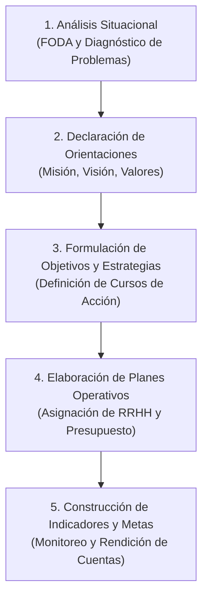

# 📘 Marianela Armijo — Planificación Estratégica en el Sector Público

* **Texto de Referencia**: *Manual de Planificación Estratégica e Indicadores de Desempeño en el Sector Público* (ILPES / CEPAL, 2009).
* **Unidad**: Unidad 1 — Planificación Estratégica de Recursos Humanos.
* **Cátedra**: Gestión de Recursos Humanos III.

---

## 🧭 1. Concepto y Enfoque Central

Marianela Armijo aborda la **Planificación Estratégica (PE)** desde la óptica de la **Gestión por Resultados (GpR)** y la modernización del Estado. Para la autora:

> La planificación estratégica es una herramienta de gestión orientada a definir **prioridades, objetivos y estrategias**, sirviendo como base ineludible para la toma de decisiones y la **asignación eficiente de los recursos públicos (financieros y humanos)**.

### 🔗 La Articulación con el Presupuesto
Uno de los aportes centrales de Armijo es que la planificación estratégica **no puede ser un ejercicio teórico aislado**:
* La PE pierde sentido y aplicabilidad si no se encuentra estrechamente vinculada al **presupuesto y a la programación financiera plurianual**.
* Los planes de recursos humanos deben justificarse en términos del costo fiscal y de la capacidad real de financiar la dotación de personal necesaria para alcanzar las metas.

---

## 🏛️ 2. Componentes Estratégicos Institucionales

Armijo desglosa la arquitectura de la planificación en cinco piezas fundamentales:

1. **Misión Institucional**:
   * Es la razón de ser de la entidad u organización pública.
   * Responde a: *¿Quiénes somos? ¿Qué hacemos? ¿Para quiénes lo hacemos? ¿Qué bienes o servicios (productos estratégicos) entregamos y qué valor público generamos?*
2. **Visión Institucional**:
   * Proyección y valores compartidos sobre la situación futura deseada a largo plazo.
   * Orienta la dirección hacia donde la institución aspira llegar en un horizonte temporal determinado.
3. **Objetivos Estratégicos**:
   * Expresión concreta de los logros o resultados que la organización se propone alcanzar en un plazo específico.
   * Deben ser claros, medibles y orientados a resolver los problemas identificados en el diagnóstico.
4. **Estrategias y Planes de Acción Operativos**:
   * Las vías o cursos de acción para cerrar la brecha entre el estado actual y los objetivos estratégicos.
   * Detallan plazos, responsables, cronogramas y requerimientos presupuestarios y de dotación humana.
5. **Indicadores de Desempeño y Metas**:
   * Parámetros cuantitativos y cualitativos que permiten monitorear sistemáticamente el grado de cumplimiento de los objetivos.

---

## 📊 3. Niveles Organizacionales y Tipos de Indicadores

Armijo establece una correlación directa entre los **niveles de decisión organizacional** y los tipos de control e indicadores:

| Nivel Organizacional | Tipo de Planificación / Control | Foco de Medición | Dimensión Evaluada |
| :--- | :--- | :--- | :--- |
| **Alta Dirección** | Planificación Estratégica | Global e Institucional | **Impacto y Resultado Final** (Resultados e impactos en la ciudadanía/usuarios). |
| **Nivel Directivo** | Control de Gestión | Centros de Responsabilidad / Programas | **Eficacia, Eficiencia, Economía y Calidad** en la entrega de productos estratégicos. |
| **Nivel Operativo** | Control de Actividades | Tareas y Procesos Cotidianos | **Insumos, Procesos y Productos intermedios** (horas de trabajo, costos unitarios, tiempos de ciclo). |

---

## 🔄 4. Etapas del Proceso de Planificación

El modelo propuesto por Armijo se desarrolla de forma secuencial y articulada:

1. **Diagnóstico y Análisis Situacional**: Evaluación del marco legal, problemas sustantivos de los usuarios y análisis de fortalezas, oportunidades, debilidades y amenazas (FODA).
2. **Definición de Misión y Visión**: Consenso directivo sobre el rumbo y alcance de los servicios.
3. **Fijación de Objetivos Estratégicos**: Priorización de áreas de impacto prioritario.
4. **Planes Operativos y de Recursos**: Especificación de dotación de personal, perfiles requeridos y financiamiento.
5. **Monitoreo y Evaluación Continua**: Implementación del tablero de indicadores para retroalimentar el proceso.

---

## 🎯 5. Aporte Específico a la Planificación de RRHH

* **Del gasto al valor público**: Los recursos humanos en el sector público no se gestionan meramente como un costo salarial, sino como la **capacidad instalada esencial** para proveer los bienes y servicios estratégicos del Estado.
* **Justificación de dotaciones**: Cualquier ampliación, reestructuración o plan de capacitación de personal debe guardar estricta correspondencia con los **objetivos estratégicos y metas de impacto** fijadas en el plan institucional.
* **Criterios de evaluación**: Introduce las cuatro dimensiones clave (**Eficacia, Eficiencia, Economía y Calidad**) para auditar la contribución del personal al logro de las políticas públicas.
