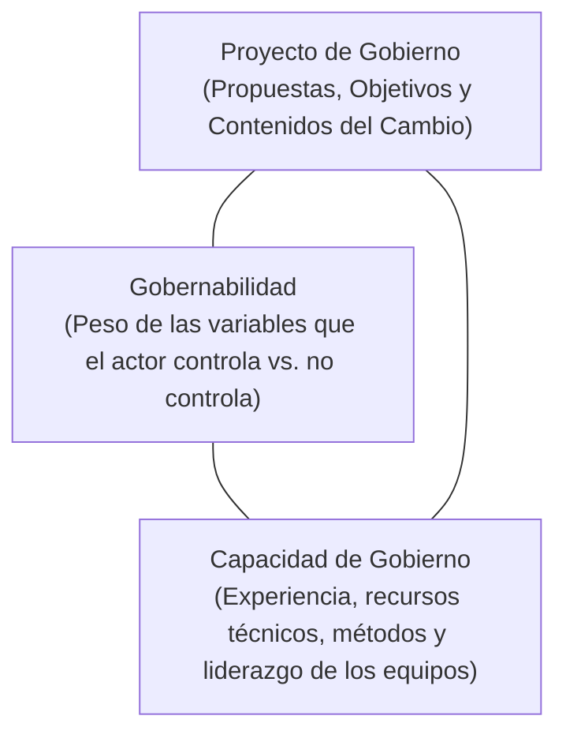
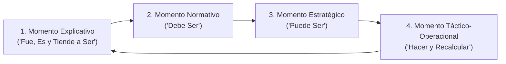

# 📘 Alfredo Ossorio — Planeamiento Estratégico y Planificación Situacional

* **Texto de Referencia**: *Planeamiento Estratégico* (Dirección Nacional de Estudios e Investigaciones, INAP / FLACSO, 2003).
* **Unidad**: Unidad 1 — Planificación Estratégica de Recursos Humanos.
* **Cátedra**: Gestión de Recursos Humanos III.

---

## 🧭 1. Concepto Central: Distinción entre Plan y Estrategia

Alfredo Ossorio establece una diferencia conceptual clave que estructura todo su pensamiento:

* **El Plan**: Es una toma anticipada de decisiones orientada a un fin. Es un método formal de reflexión previa y concomitante con la acción humana, formulado para alcanzar un estado futuro deseado.
* **La Estrategia**: Es un **estilo y método de pensamiento dinámico** sobre la acción. A diferencia del plan formal, la estrategia reconoce que la realidad está compuesta por **múltiples actores sociales con distintas voluntades, intereses y cuotas de poder**, que interactúan en escenarios de colaboración, negociación o conflicto.

> *"La estrategia es el arte de conducir operaciones en un contexto donde otros juegan y tienen capacidad de incidir o bloquear nuestros propios planes."*

---

## ⚡ 2. La Ruptura Epistemológica: Planificación Tradicional vs. Planificación Situacional

Ossorio adopta la crítica formulada por Carlos Matus sobre la incapacidad de la planificación tecnocrática clásica para transformar la realidad:

| Dimensión | Planificación Tradicional (Normativa / Singular) | Planificación Estratégica Situacional (PES / Plural) |
| :--- | :--- | :--- |
| **Sujeto Planificador** | El planificador es un **técnico o experto externo** que observa la realidad "desde afuera" como un objeto. | El planificador es un **actor social situado**, inmerso dentro de la misma realidad que pretende transformar. |
| **Monopolio del Plan** | Se asume que solo el Estado o la Dirección planifica. | **Múltiples actores planifican simultáneamente** con intereses divergentes o encontrados. |
| **Certeza del Futuro** | Supone un futuro predecible con diagnósticos únicos basados en certezas ("el plan libro"). | Reconoce la **incertidumbre dura** y la existencia de múltiples escenarios posibles. |
| **Explicación de la Realidad** | Existe un único diagnóstico verdadero (técnico-económico). | Existen **múltiples explicaciones situacionales** según el punto de vista y la posición del actor. |
| **Enfoque de Viabilidad** | Asume que lo que es técnicamente deseable es automáticamente viable. | La **viabilidad política, económica, institucional y cultural** debe ser construida activamente. |

---

## 🔺 3. El Triángulo de Gobierno (Carlos Matus)

Ossorio retoma el esquema de Matus para explicar que la efectividad de cualquier conducción o gestión estratégica reside en la articulación armónica de tres vértices:

1. **Proyecto de Gobierno (PG)**: Define los objetivos, políticas, programas y transformaciones que se buscan realizar.
2. **Gobernabilidad del Sistema (G)**: La relación entre las variables que el gobernante/gerente controla y las que no controla (condicionantes del contexto, sindicatos, presiones políticas).
3. **Capacidad de Gobierno (CG)**: El acervo de pericia, conocimientos, métodos organizacionales, destrezas técnicas y recursos humanos del equipo conductor.

---

## 🔄 4. Los Cuatro Momentos de la Planificación Situacional

La PES no concibe etapas cronológicas cerradas, sino **cuatro momentos interdependientes y continuos** que se retroalimentan constantemente:

### 1. Momento Explicativo (Apreciación de la Situación)
* Se indaga la génesis y manifestación de los problemas: *¿Cómo fue, cómo es y cómo tiende a ser la situación?*
* Se construye el **Árbol de Problemas** (causas y efectos) y se identifican los **actores sociales involucrados** (clasificados en aliados, adversarios y neutros).

### 2. Momento Normativo (El Diseño del Plan)
* Se diseña la situación objetivo o utopía viable: el **"Debe Ser"**.
* Formulación de la Misión, Visión, árbol de objetivos y matriz de metas deseadas.

### 3. Momento Estratégico (La Construcción de Viabilidad)
* Es el puente crucial que conecta el *"Debe Ser"* con el *"Puede Ser"*.
* Analiza las restricciones de poder, recursos y voluntades. Evalúa qué alianzas tejer, qué tácticas de persuasión emplear y qué recursos críticos movilizar para vencer las resistencias y oposiciones al plan.

### 4. Momento Táctico-Operacional (Acción y Recálculo Permanente)
* Es el momento de la ejecución cotidiana: el **"Hacer"**.
* La agenda del decisor se confronta con la coyuntura. Se monitorea la trayectoria y se aplica el **recálculo constante**: corregir el rumbo a medida que surgen imprevistos o jugadas de otros actores.

---

## 🎯 5. Aporte a la Planificación Estratégica de RRHH

* **El área de RRHH como actor situado**: Quien lidera Recursos Humanos no es un burócrata neutral; es un actor con intereses, visiones y límites de gobernabilidad dentro del mapa de poder corporativo o estatal.
* **Políticas de personal con viabilidad política**: Las políticas salariales, las reestructuraciones y los cambios de carrera no se implementan por mero decreto técnico; requieren **construir consensos y negociar viabilidad** con sindicatos, directivos de línea y delegados gremiales.
* **El personal como variable de Capacidad de Gobierno**: Para que cualquier proyecto estratégico institucional se concrete, el área de Recursos Humanos debe proveer y potenciar las competencias, motivación y estructura del personal que conforma la **Capacidad de Gobierno (CG)** de la organización.
