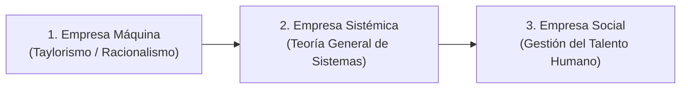

# 📘 Luis Carlos Palacios Acero — Dirección Estratégica

* **Texto de Referencia**: *Dirección Estratégica* (2ª Edición, Ecoe Ediciones).
* **Unidad**: Unidad 1 — Planificación Estratégica de Recursos Humanos.
* **Cátedra**: Gestión de Recursos Humanos III.

---

## 🧭 1. Concepto de Dirección Estratégica

Luis Carlos Palacios Acero concibe la **Dirección Estratégica** como:

> El arte y la ciencia de poner en práctica y desarrollar todo el potencial de la organización para asegurar su **supervivencia y sostenibilidad a largo plazo**, elevando continuamente su **competitividad, eficacia, eficiencia y productividad** en entornos dinámicos e inciertos.

La dirección estratégica supera la simple planificación estática: es un proceso gerencial integral que enlaza el diagnóstico del entorno con la capacidad operativa y humana para ejecutar y transformar.

---

## 🏭 2. Evolución Histórica de los Estados Empresariales

Palacios Acero describe cómo ha evolucionado la concepción de la empresa y del factor humano a lo largo del tiempo:

1. **Empresa Máquina**:
   * Los trabajadores son vistos como meros engranajes mecánicos sustituibles.
   * Supone bajo nivel educativo en la fuerza laboral; se caracteriza por esquemas piramidales cerrados, control coercitivo, división fragmentada del trabajo y relaciones laborales autoritarias.
2. **Empresa Sistémica**:
   * Concibe a la organización como un sistema abierto compuesto por subsistemas interdependientes en constante intercambio de materia, energía e información con el entorno.
   * Los puestos se tecnifican y se formalizan los procesos y canales de comunicación interdepartamental.
3. **Empresa Social (El Paradigma Actual)**:
   * La organización es concebida como un organismo vivo con identidad propia.
   * El eje central se desplaza hacia la **salud integral, la seguridad, la capacitación continua, el compromiso, el clima laboral y el bienestar físico y psicológico** de las personas.
   * Las personas ya no son un "insumo pasivo", sino los verdaderos artífices de la innovación y la ventaja competitiva.

---

## 🔄 3. Modelo Dinámico de Formación de Estrategias

Palacios Acero propone un ciclo continuo y adaptativo donde interactúan cuatro componentes esenciales:

$$\text{Análisis Estratégico} \longleftrightarrow \text{Formulación Estratégica} \longleftrightarrow \text{Planificación Estratégica} \longleftrightarrow \text{Implantación y Control}$$

### Estrategias Deliberadas vs. Estrategias Emergentes
El autor adopta la perspectiva de Henry Mintzberg: la estrategia real de una firma no es sólo lo que se planificó originalmente en el papel (**estrategia deliberada o planeada**), sino la síntesis que surge cuando el plan interactúa con los imprevistos, oportunidades y aprendizajes del terreno (**estrategias emergentes**).

---

## 📐 4. Niveles de Prospectiva y Decisión Empresarial

La dirección estratégica opera simultáneamente en tres niveles jerárquicos y temporales:

| Nivel | Alcance Temporal | Foco Principal | Responsable |
| :--- | :--- | :--- | :--- |
| **Institucional o Estratégico** | Largo Plazo (3 a 5+ años) | Misión global, posicionamiento de mercado, diversificación y cultura corporativa. | Directorio y Gerencia General (Alta Dirección). |
| **Táctico o Funcional** | Mediano Plazo (1 a 3 años) | Coordinación y asignación de recursos a nivel de áreas (RRHH, Finanzas, Operaciones, Marketing). | Gerentes de Departamento / Área. |
| **Operacional** | Corto Plazo (Día a día / Anual) | Ejecución de rutinas, cronogramas de tareas, cumplimiento de estándares de calidad. | Supervisores y Jefes de Equipo. |

---

## 🛠️ 5. Instrumental de Planeación y Gestión

Palacios Acero presenta un nutrido abanico de metodologías aplicables a la gestión estratégica:

* **Balanced Scorecard (BSC / Cuadro de Mando Integral)**: Traduce la visión y estrategia en objetivos e indicadores agrupados en cuatro perspectivas: Financiera, Clientes, Procesos Internos, y **Aprendizaje y Crecimiento (donde reside el talento humano)**.
* **Matriz DOFA / FODA**: Cruce de factores internos (Debilidades y Fortalezas) con factores del entorno (Oportunidades y Amenazas).
* **Diagrama Causa-Efecto (Ishikawa / Espina de Pescado)**: Identificación y análisis de raíces causales en problemas operativos.
* **Herramientas de Programación de Proyectos**: Gráficas de Gantt y redes PERT/CPM para secuenciar hitos y plazos de ejecución.
* **Metodología TRIZ**: Teoría de resolución inventiva de problemas para superar contradicciones de diseño u operativas sin generar nuevos costos.

---

## 🎯 6. Aporte a la Planificación Estratégica de RRHH

* **El talento como activo de diferenciación**: En la *Empresa Social*, las máquinas y la tecnología se pueden comprar o copiar, pero las **habilidades distintivas, el conocimiento tácito y el involucramiento del personal** son inimitables y constituyen la verdadera fuente de valor agregado.
* **Perspectiva de Aprendizaje en el BSC**: Sitúa al subsistema de personal como la base que sustenta la mejora de los procesos internos, la satisfacción del cliente y el rendimiento financiero.
* **Flexibilidad y respuesta emergente**: Brinda a los directores de RRHH la agilidad para reconfigurar perfiles y dotaciones frente a crisis o cambios repentinos en el mercado.
