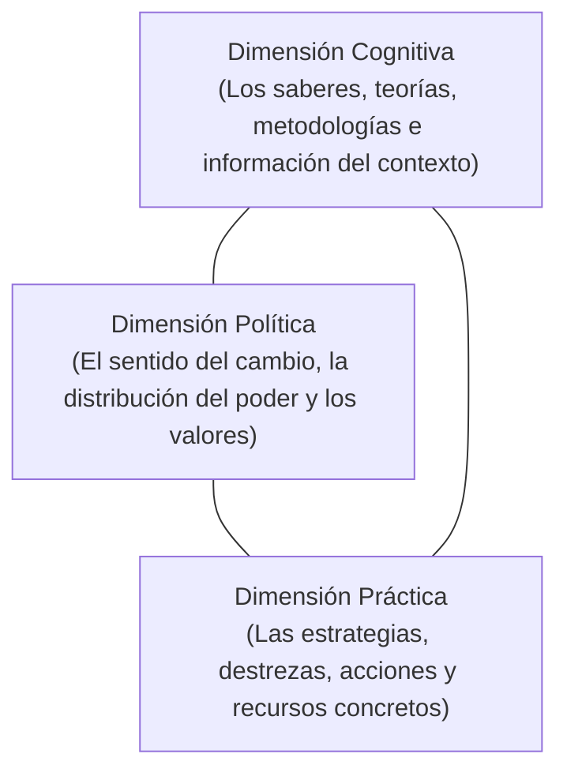
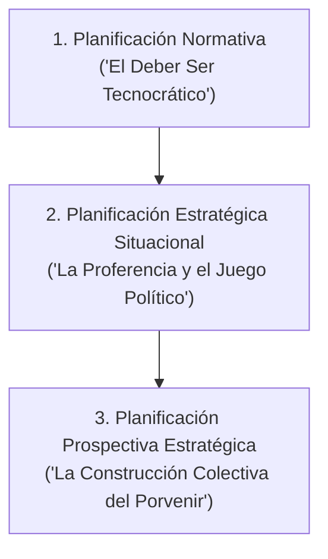

# 📘 Martín Iglesias, Cecilia Pagola y Washington Uranga — Enfoques de Planificación

* **Texto de Referencia**: *Enfoques de Planificación* (Facultad de Periodismo y Comunicación Social, Universidad Nacional de La Plata - UNLP, 2012).
* **Unidad**: Unidad 1 — Planificación Estratégica de Recursos Humanos.
* **Cátedra**: Gestión de Recursos Humanos III.

---

## 🧭 1. La Planificación como Función de Gestión Integral

Iglesias, Pagola y Uranga definen la planificación no como una mera técnica burocrática, sino como una **fase constitutiva e ineludible de la gestión**:

> La planificación es un proceso reflexivo, analítico y sistemático que diseña los pasos orientados a intervenir sobre la realidad para transformarla.

Los autores señalan que toda planificación articula simultáneamente **tres dimensiones indisolubles**:



1. **Dimensión Cognitiva**: El marco conceptual y el caudal de información que fundamenta el diagnóstico.
2. **Dimensión Política**: La intencionalidad transformadora, el rumbo y la disputa por el sentido del cambio social o institucional.
3. **Dimensión Práctica / Operativa**: El conjunto de dispositivos, tácticas y herramientas que materializan la acción.

---

## 🔮 2. Proferencia vs. Prospectiva (Aporte de Agustín Merello)

Siguiendo las formulaciones del teórico Agustín Merello, los autores diferencian dos formas radicalmente distintas de relacionarse con el porvenir:

| Criterio | Proferencia | Prospectiva |
| :--- | :--- | :--- |
| **Punto de Partida** | **El pasado y el presente**. | **El futuro deseado**. |
| **Lógica Metodológica** | Extrapola tendencias estadísticas o históricas hacia adelante (*¿qué pasará si las cosas continúan como hasta hoy?*). | Se instala mentalmente en la imagen objetivo deseada y **viaja desde el futuro hacia el presente** para construirlo. |
| **Enfoques Incluidos** | Incluye a la **Planificación Normativa Clásica** y a la **Planificación Estratégica Situacional**. | Fundamenta a la **Planificación Prospectiva Estratégica**. |
| **Rol del Futuro** | El futuro es un destino probable condicionado por la inercia del pasado. | El futuro es un **espacio múltiple y abierto a la invención humana y social**. |

---

## 🏛️ 3. Tipología de los Tres Grandes Estilos de Planificación

Los autores estructuran la evolución del pensamiento planificador en tres grandes corrientes:



### 1. Planificación Normativa (Clásica / Tradicional)
* **Lógica**: Basada en la racionalidad formal y en el *"deber ser"* técnico.
* **Actores**: El diagnóstico y el documento final son elaborados exclusivamente por técnicos y planificadores expertos en gabinetes cerrados.
* **Resultado típico**: El denominado **"plan libro"** o manual rígido, que con frecuencia queda archivado al no considerar las complejidades, conflictos e incertidumbres de la realidad.

### 2. Planificación Estratégica Situacional (PES)
* **Lógica**: Apoyada en la proferencia y el análisis crítico de la correlación de fuerzas entre actores sociales.
* **Premisa central**: *"Planifica quien gobierna"*. La viabilidad del plan depende de la destreza política, el poder relativo y la capacidad de negociación del actor que conduce frente a sus oponentes y aliados.
* **Limitación**: Tiende a concentrarse en las jugadas a corto y mediano plazo de la cúpula gobernante o gerencial.

### 3. Planificación Prospectiva Estratégica (Participativa)
* **Lógica**: Concibe el futuro como una construcción colectiva alimentada por los **sueños, deseos, utopías e imágenes objetivo** de los distintos sujetos de la organización.
* **Metodología**: Identifica las variables clave del sistema, proyecta diversos escenarios posibles y formula las estrategias necesarias para acortar la brecha entre el presente real y el futuro elegido.
* **Protagonismo**: Descentralizada, dialógica y participativa.

---

## 📊 4. Matriz de Gabriel Kaplún: Racionalidades y Actores

Los autores integran el modelo del comunicador Gabriel Kaplún para diagnosticar los estilos de planeamiento según dos ejes de tensión:

```
                  EJE DE LOS ACTORES
            Tarea exclusiva de Expertos
                        ▲
                        │  (A) Tradicional /       (B) Planificación
                        │      Burocrática             Estratégica Directiva
                        │
EJE DE LA ──────────────┼────────────────────────► EJE DE LA
RACIONALIDAD            │                          RACIONALIDAD
Previsión estricta /    │  (C) Participativa       (D) Participación Dialógica /
Racionalidad simple     │      Formal o Asamblearia    Aprendizaje Colectivo
                        │
                        ▼
            Construcción Colectiva / Afectados
```

* **Cuadrante A**: Planificación tecnocrática rígida (baja flexibilidad, exclusión de la base).
* **Cuadrante B**: Dirección estratégica moderna orientada por objetivos gerenciales.
* **Cuadrante C**: Espacios participativos donde se discuten tareas pero sin un marco estratégico complejo.
* **Cuadrante D (El Óptimo Comunicacional)**: Procesos colaborativos de aprendizaje institucional donde directivos y trabajadores co-diseñan el futuro con rigor estratégico.

---

## 🎯 5. Aporte a la Planificación Estratégica de RRHH

* **Dimensión Comunicacional y Subjetiva**: Demuestra que los planes de Recursos Humanos no pueden diseñarse como meros diagramas de flujo tecnocráticos; son **dispositivos de comunicación social** que deben dotar de sentido y legitimidad al trabajo cotidiano.
* **Integración de los Saberes de los Colaboradores**: Las políticas de personal ganan eficacia real cuando incorporan el conocimiento práctico de los trabajadores y respetan sus aspiraciones individuales y colectivas.
* **Superación del "Plan Libro"**: Enseña a las gerencias de RRHH a abandonar las directivas inflexibles y reemplazarlas por **marcos prospectivos de diálogo continuo**, alineando los proyectos personales de carrera con el rumbo institucional.
