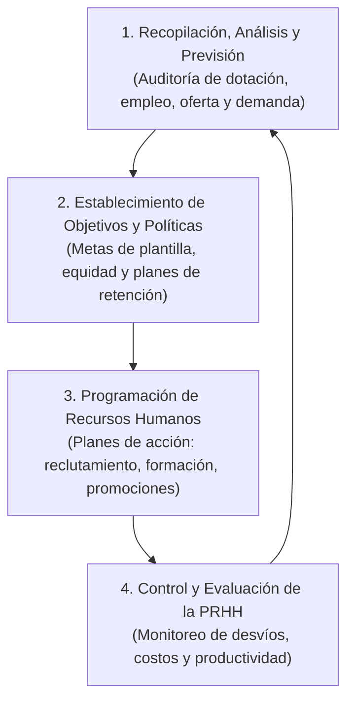

# 📘 Simón Dolan — Planificación de los Recursos Humanos

* **Texto de Referencia**: *La Gestión de los Recursos Humanos* (Capítulo 3: "Planificación de los recursos humanos", McGraw-Hill, 1999).
* **Unidad**: Unidad 1 — Planificación Estratégica de Recursos Humanos.
* **Cátedra**: Gestión de Recursos Humanos III.

---

## 🧭 1. Concepto y Fines de la Planificación de RRHH (PRHH)

Simón Dolan define la **Planificación de los Recursos Humanos (PRHH)** como:

> El proceso formal de elaborar e implantar planes y programas para asegurarse de que estén disponibles el **número apropiado (cuantitativo)** y el **tipo apropiado (cualitativo: aptitudes, competencias y calificaciones)** de personas, en el **momento oportuno y en el lugar adecuado**, traduciendo los objetivos corporativos en requerimientos efectivos de plantilla.

### 🎯 Los Cuatro Fines Principales de la PRHH
1. **Reducir costos corrigiendo desequilibrios**: Prevenir y corregir tanto las carencias críticas de personal como los excesos de plantilla que generan costos ociosos.
2. **Optimizar las aptitudes y capacidades del personal**: Facilitar que los colaboradores ocupen posiciones donde su rendimiento sea máximo.
3. **Mejorar la planificación global de la empresa**: Aportar a la alta dirección proyecciones realistas sobre la viabilidad laboral de los planes de negocio.
4. **Evaluar las políticas y programas de gestión humana**: Monitorear el impacto de la selección, formación y retención en los resultados de la organización.

---

## ⚠️ 2. La "Paradoja o Conflicto" de la PRHH según Dolan

Un punto medular destacado reiteradamente por la cátedra en sus clases:
* **El 100% de los directivos y profesionales** reconoce en las encuestas la importancia estratégica y vital de planificar el personal.
* Sin embargo, en la práctica real, **apenas un 16% de las organizaciones** ejecuta una planificación de recursos humanos formal y rigurosa.
* **Causas del déficit**: La PRHH suele verse postergada por las urgencias del día a día, la complejidad técnica de los métodos cuantitativos y la exigencia de contar con **Sistemas de Información de RRHH (SIRH)** integrados y actualizados.

---

## ⚖️ 3. El Balance de Personal: Oferta vs. Demanda

El núcleo operativo de la PRHH consiste en contrastar sistemáticamente los requerimientos futuros con las disponibilidades:

```
[ Previsión de la Demanda de RRHH ]  ◄──────►  [ Previsión de la Oferta de RRHH ]
       (Personal Necesario)                           (Personal Disponible)
                                    ▼
                      [ Necesidades Netas / Brecha ]
           ┌────────────────────────┴────────────────────────┐
           ▼                                                 ▼
[ Demanda > Oferta ]                              [ Oferta > Demanda ]
• Reclutamiento y selección                       • Congelamiento de vacantes
• Horas extras                                    • Retiros voluntarios / Jubilaciones
• Tercerización / Capacitación                    • Reasignaciones / Reducción horaria
```

### A. Previsión de la Demanda (Técnicas Cuantitativas y Cualitativas)
* **Métodos Cualitativos / Basados en Juicios**:
  * *Estimaciones de la gerencia*: Proyecciones de los supervisores y directores de línea.
  * *Técnica Delphi*: Rondas sucesivas de consultas anónimas a un panel de expertos hasta alcanzar consenso.
  * *Técnica de Grupo Nominal*: Discusión estructurada con votación y ponderación de ideas.
* **Métodos Cuantitativos / Estadísticos**:
  * *Regresión lineal simple y múltiple*: Relación entre el volumen de ventas/producción y la dotación requerida.
  * *Curvas de aprendizaje*: Reducción progresiva de horas-hombre requeridas a medida que el personal gana experiencia.
  * *Series temporales y ratios de productividad*: Extrapolación histórica ponderada por índices de productividad.

### B. Previsión de la Oferta (Mercado Interno y Externo)
* **Oferta Interna**:
  * *Inventario de personal / de habilidades*: Base de datos detallada de perfiles, competencias, antigüedad y potencial.
  * *Matrices de sustitución / Cuadros de reemplazo*: Identificación de los sucesores inmediatos para puestos clave.
  * *Cadenas de Markov*: Modelos estocásticos de probabilidad de que un empleado permanezca en su puesto, sea ascendido, trasladado o abandone la empresa en un período dado.
* **Oferta Externa**:
  * Análisis demográfico, tasas de graduación, mercado de trabajo local y movilidad ocupacional.

---

## 🔄 4. Las Cuatro Etapas del Proceso de PRHH

Dolan sistematiza el ciclo de planificación en cuatro fases secuenciales:



1. **Primera Etapa — Diagnóstico y Pronóstico**: Auditoría de la plantilla actual, evaluación de la estructura organizativa, productividad y presupuesto laboral.
2. **Segunda Etapa — Fijación de Objetivos**: Definición de metas concretas de personal alineadas con el plan corporativo (ej. incremento de dotación técnica, reconversión de perfiles).
3. **Tercera Etapa — Programación Operativa**: Ejecución de las tácticas de ajuste (selección externa, capacitación intensiva, reestructuración o reducción).
4. **Cuarta Etapa — Control y Retroalimentación**: Auditoría de desvíos entre lo proyectado y lo real, alimentando el Sistema de Información de Recursos Humanos (SIRH).

---

## 🎯 5. Aporte a la Planificación Estratégica de RRHH

* **El personal como inversión capitalizable**: Dolan combate la mirada tradicional del personal como "gasto administrativo variable", demostrando que las erogaciones en captación y desarrollo son **inversiones que generan retorno financiero medible**.
* **Rigor métrico y analítico**: Dota al área de RRHH de un arsenal cuantitativo formal (curvas de aprendizaje, Delphi, Markov, análisis de regresión) para fundamentar sus demandas ante el directorio con datos duros.
* **El SIRH como columna vertebral**: Postula que no puede haber planificación estratégica sin una base de datos de personal automatizada, fidedigna e integrada con los demás sistemas de la empresa.
