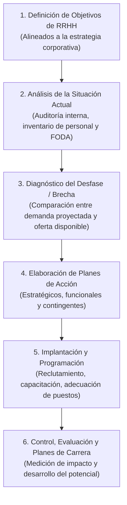

# 📘 Mendoza, López y Salas — Planificación Estratégica de Recursos Humanos

* **Texto de Referencia**: *Planificación estratégica de recursos humanos. Efectiva forma de identificar necesidades de personal* (Revista Económicas CUC, 2015).
* **Autores**: Darcy Mendoza Fernández, Dany López Juvinao y Edwin Salas Solano.
* **Unidad**: Unidad 1 — Planificación Estratégica de Recursos Humanos.
* **Cátedra**: Gestión de Recursos Humanos III.

---

## 🧭 1. Concepto de Planificación Estratégica de RRHH (PERHH)

Los autores definen la **Planificación Estratégica de Recursos Humanos (PERHH)** como:

> El proceso directivo, dinámico y proactivo mediante el cual una organización analiza sistemáticamente sus necesidades presentes y futuras de talento humano en función de un entorno cambiante, con el fin de **situar al número adecuado de personas capacitadas, con las competencias requeridas, en los puestos correctos y en el momento preciso**.

### ☂️ La "Función Sombrilla" de la PERHH
Mendoza, López y Salas introducen la sugerente metáfora de la **función sombrilla**:
* La PERHH no es un trámite aislado de selección o liquidación, sino un **gran paraguas integrador** que cobija, articula y orienta todas las políticas, prácticas, normativas y la filosofía de gestión de personas.
* Conecta el planeamiento estratégico institucional con los subsistemas operativos: reclutamiento, selección, inducción, capacitación, evaluación del desempeño, remuneraciones y planes de carrera.

---

## 📌 2. La Piedra Angular: El Análisis y Descripción de Puestos

Para los autores, ningún modelo de planificación estratégica puede funcionar sin una base técnica sólida:
* **El Análisis y Descripción de Puestos es el pilar fundamental** de la PERHH.
* Determina con precisión los deberes, responsabilidades, condiciones de trabajo y los **requisitos o competencias mínimas** que debe poseer quien ocupe la posición.
* Sirve como patrón objetivo e indispensable para:
  1. El perfil de búsqueda en el reclutamiento.
  2. La evaluación objetiva del desempeño y la detección de brechas de formación.
  3. La equidad salarial interna.

---

## 💡 3. Razones de Importancia Estratégica (Aporte de Milkovich y Boudreau)

Mendoza et al. destacan tres motivos críticos por los cuales las organizaciones modernas no pueden prescindir de la PERHH:

1. **Retención en Calidad y Cantidad**: Evita la pérdida de talento clave en un mercado laboral altamente competitivo y previene tanto el déficit como la sobrepoblación de personal.
2. **Previsión del Desfase Temporal (*Lead Time*)**: Entre el momento en que se detecta una vacante o necesidad de personal y el momento en que el nuevo colaborador está efectivamente seleccionado, contratado y operando con productividad plena transcurre un período considerable. La PERHH anticipa esta ventana de tiempo.
3. **Reducción de la Rotación y el Ausentismo**: Diseña planes de acogida, motivación y desarrollo que disminuyen drásticamente los costosos índices de rotación no deseada.

---

## 🔄 4. Fases Integradas del Proceso de PERHH

Los autores articulan las propuestas clásicas (como el modelo de 6 fases de Jiménez) en un esquema estructurado orientado a competencias:

### Detalle de las Etapas:
1. **Fijación de Objetivos**: Traducir metas de crecimiento, apertura de sucursales o tecnificación en metas de dotación.
2. **Diagnóstico Situacional (FODA)**: Análisis de la plantilla interna (antigüedad, pirámide de edad, calificaciones) y del mercado de trabajo externo.
3. **Análisis de Brechas (Gap Analysis)**: Identificar qué perfiles faltarán, cuáles quedarán obsoletos y qué competencias nuevas deberán desarrollarse.
4. **Formulación de Planes de Personal**:
   * *Planes de Adquisición*: Búsqueda, atracción y selección.
   * *Planes de Desarrollo y Capacitación*: Formación continua para reconvertir personal existente.
   * *Planes de Retención*: Compensaciones, beneficios y clima laboral.
5. **Ejecución y Despliegue**: Aplicación práctica con cronogramas y presupuestos asignados.
6. **Evaluación y Planes de Carrera**: Auditoría de resultados que nutre la línea de sucesión y el crecimiento profesional de los colaboradores.

---

## 🎯 5. Aporte a la Planificación Estratégica de RRHH

* **Gestión por Competencias y Planes de Carrera**: Demuestran que la planificación de personal no busca simplemente "llenar casilleros", sino gestionar de forma integral las **competencias individuales y colectivas**, asegurando que los colaboradores puedan proyectar su carrera dentro de la organización.
* **Transformación del Rol de RRHH**: El área de talento humano deja de ser un departamento administrativo reactivo ("gestoría de sueldos y legajos") para erigirse en un **socio estratégico del negocio**, capaz de justificar su impacto directo en la productividad y la creación de valor.
* **Aplicabilidad Mixta**: Su modelo resulta igualmente operativo para empresas del sector privado como para organismos de la administración pública.
