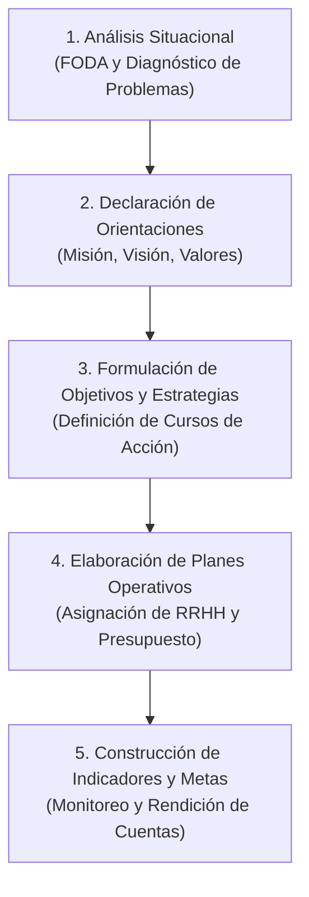

# 📘 Marianela Armijo — Planificación Estratégica en el Sector Público

* **Texto de Referencia**: *Manual de Planificación Estratégica e Indicadores de Desempeño en el Sector Público* (ILPES / CEPAL, 2009).
* **Unidad**: Unidad 1 — Planificación Estratégica de Recursos Humanos.
* **Cátedra**: Gestión de Recursos Humanos III.

---

## 🧭 1. Concepto y Enfoque Central

Marianela Armijo aborda la **Planificación Estratégica (PE)** desde la óptica de la **Gestión por Resultados (GpR)** y la modernización del Estado. Para la autora:

> La planificación estratégica es una herramienta de gestión orientada a definir **prioridades, objetivos y estrategias**, sirviendo como base ineludible para la toma de decisiones y la **asignación eficiente de los recursos públicos (financieros y humanos)**.

### 🔗 La Articulación con el Presupuesto
Uno de los aportes centrales de Armijo es que la planificación estratégica **no puede ser un ejercicio teórico aislado**:
* La PE pierde sentido y aplicabilidad si no se encuentra estrechamente vinculada al **presupuesto y a la programación financiera plurianual**.
* Los planes de recursos humanos deben justificarse en términos del costo fiscal y de la capacidad real de financiar la dotación de personal necesaria para alcanzar las metas.

---

## 🏛️ 2. Componentes Estratégicos Institucionales

Armijo desglosa la arquitectura de la planificación en cinco piezas fundamentales:

1. **Misión Institucional**:
   * Es la razón de ser de la entidad u organización pública.
   * Responde a: *¿Quiénes somos? ¿Qué hacemos? ¿Para quiénes lo hacemos? ¿Qué bienes o servicios (productos estratégicos) entregamos y qué valor público generamos?*
2. **Visión Institucional**:
   * Proyección y valores compartidos sobre la situación futura deseada a largo plazo.
   * Orienta la dirección hacia donde la institución aspira llegar en un horizonte temporal determinado.
3. **Objetivos Estratégicos**:
   * Expresión concreta de los logros o resultados que la organización se propone alcanzar en un plazo específico.
   * Deben ser claros, medibles y orientados a resolver los problemas identificados en el diagnóstico.
4. **Estrategias y Planes de Acción Operativos**:
   * Las vías o cursos de acción para cerrar la brecha entre el estado actual y los objetivos estratégicos.
   * Detallan plazos, responsables, cronogramas y requerimientos presupuestarios y de dotación humana.
5. **Indicadores de Desempeño y Metas**:
   * Parámetros cuantitativos y cualitativos que permiten monitorear sistemáticamente el grado de cumplimiento de los objetivos.

---

## 📊 3. Niveles Organizacionales y Tipos de Indicadores

Armijo establece una correlación directa entre los **niveles de decisión organizacional** y los tipos de control e indicadores:

| Nivel Organizacional | Tipo de Planificación / Control | Foco de Medición | Dimensión Evaluada |
| :--- | :--- | :--- | :--- |
| **Alta Dirección** | Planificación Estratégica | Global e Institucional | **Impacto y Resultado Final** (Resultados e impactos en la ciudadanía/usuarios). |
| **Nivel Directivo** | Control de Gestión | Centros de Responsabilidad / Programas | **Eficacia, Eficiencia, Economía y Calidad** en la entrega de productos estratégicos. |
| **Nivel Operativo** | Control de Actividades | Tareas y Procesos Cotidianos | **Insumos, Procesos y Productos intermedios** (horas de trabajo, costos unitarios, tiempos de ciclo). |

---

## 🔄 4. Etapas del Proceso de Planificación

El modelo propuesto por Armijo se desarrolla de forma secuencial y articulada:

1. **Diagnóstico y Análisis Situacional**: Evaluación del marco legal, problemas sustantivos de los usuarios y análisis de fortalezas, oportunidades, debilidades y amenazas (FODA).
2. **Definición de Misión y Visión**: Consenso directivo sobre el rumbo y alcance de los servicios.
3. **Fijación de Objetivos Estratégicos**: Priorización de áreas de impacto prioritario.
4. **Planes Operativos y de Recursos**: Especificación de dotación de personal, perfiles requeridos y financiamiento.
5. **Monitoreo y Evaluación Continua**: Implementación del tablero de indicadores para retroalimentar el proceso.

---

## 🎯 5. Aporte Específico a la Planificación de RRHH

* **Del gasto al valor público**: Los recursos humanos en el sector público no se gestionan meramente como un costo salarial, sino como la **capacidad instalada esencial** para proveer los bienes y servicios estratégicos del Estado.
* **Justificación de dotaciones**: Cualquier ampliación, reestructuración o plan de capacitación de personal debe guardar estricta correspondencia con los **objetivos estratégicos y metas de impacto** fijadas en el plan institucional.
* **Criterios de evaluación**: Introduce las cuatro dimensiones clave (**Eficacia, Eficiencia, Economía y Calidad**) para auditar la contribución del personal al logro de las políticas públicas.

---

## 🎓 6. Énfasis de Cátedra y Clases Desgrabadas (Tips de Examen Parcial)

A partir del análisis de las clases desgrabadas de la materia, el equipo docente subraya los siguientes puntos ineludibles para las evaluaciones:

* **Misión como Brújula Institucional**: La docente enfatiza que la misión debe responder obligatoriamente a cuatro preguntas operativas: *¿Qué hace la organización?*, *¿Cuáles son sus productos/servicios estratégicos?*, *¿A qué usuarios o beneficiarios se dirige?* y *¿Cuáles son sus valores y localización geográfica distintiva?*. Si falta alguna de estas dimensiones en la formulación, la misión está técnicamente incompleta.
* **Visión como Faro Guía (+10 años)**: No es un objetivo operativo de corto plazo; es la proyección a largo plazo (horizonte de 10 años o más) que representa el horizonte valorativo hacia donde la institución orienta todas sus energías.
* **Regla de Oro en Objetivos Estratégicos (¡Alerta de Corrección en Parcial!)**:
  * Deben redactarse **siempre con un verbo de acción en infinitivo** (sin conjugar).
  * **Advertencia explícita del docente**: Queda terminantemente **prohibido** utilizar verbos ambiguos o blandos como *"fomentar"*, *"promover"*, *"procurar"* o *"contribuir"*, ya que representan meras expresiones de deseo o intenciones híbridas que no permiten construir un indicador de resultado medible.
  * *Ejemplo corregido en clase*: En vez de una fórmula ambigua como *"Promover la salud pública a nivel nacional"*, la cátedra exige una meta de acción concreta: *"Garantizar la cobertura de atención primaria en las primeras infancias en las regiones sanitarias prioritarias"*.
* **Análisis FODA Riguroso**: La docente advierte que el FODA suele aplicarse de forma *"trillada"* o superficial. Para el parcial exige clasificar con precisión quirúrgica:
  * **Factores Internos (Bajo control de la organización)**: Fortalezas y Debilidades.
  * **Factores Externos (Variables del entorno que la entidad no controla)**: Oportunidades y Amenazas.
* **Clasificación de los Cuatro Indicadores de Desempeño (Pregunta Fija de Examen)**:
  1. **Eficacia**: Grado de cumplimiento de los objetivos y metas finales. *(Ejemplo de clase: Porcentaje de estudiantes o participantes que culminan y aprueban un programa de capacitación sobre el total de inscriptos)*.
  2. **Eficiencia**: Relación entre los recursos (costos, horas, presupuesto) invertidos y los productos o servicios obtenidos. *(Ejemplo de clase: Costo medio por trámite resuelto o productividad de horas-hombre por expediente)*.
  3. **Economía**: Capacidad de la organización para movilizar, administrar y ejecutar oportunamente los recursos financieros. *(Ejemplo de clase: Porcentaje de ejecución presupuestaria respecto del crédito asignado; ratio de cobranzas sobre facturación)*.
  4. **Calidad**: Capacidad para responder con celeridad, exactitud y oportunidad a las expectativas de los usuarios. *(Ejemplo de clase: Tiempo promedio de espera en ventanilla; índice de satisfacción del ciudadano medido por encuestas de percepción)*.

