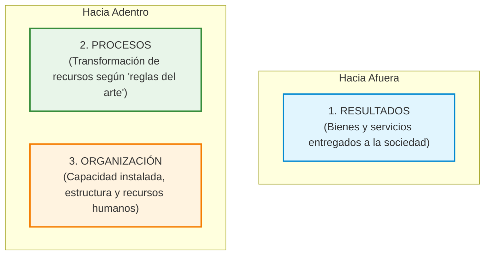

# 📘 Jorge Hintze — Control y Evaluación de Gestión y Resultados

* **Texto de Referencia**: *Control y evaluación de gestión y resultados de gestión* (Documentos TOP, 1999).
* **Unidad**: Unidad 2 — Auditoría y Control de Recursos Humanos.
* **Cátedra**: Gestión de Recursos Humanos III.

---

## 🧭 1. Distinciones Conceptuales Fundamentales

Jorge Hintze inicia su marco teórico estableciendo una delimitación rigurosa entre tres conceptos que suelen confundirse en el lenguaje cotidiano:

### A. Información
* **Definición**: Es la representación de la realidad mediante algún tipo de lenguaje (escrito, gráfico, numérico).
* **Datos vs. Información**: Los **datos** son las representaciones directas, aisladas e inmediatas de los hechos. La **información propiamente dicha** supone datos que han sido interpretados, procesados, estructurados y dotados de significado e intencionalidad para el receptor.

### B. Control
* **Definición**: Consiste en verificar los hechos registrados por la información, comparándolos contra un **patrón técnico de referencia preestablecido** (estándar, norma, procedimiento o meta operativa).
* **Naturaleza**: Es una operación técnica y objetiva. El control no emite juicios éticos ni axiológicos; simplemente constata si el hecho se adecúa o se desvía del estándar técnico prefijado.

### C. Evaluación
* **Definición**: Va un paso más allá del control. Implica la emisión de **juicios de valor** (explícitos o implícitos) al contrastar la información con **patrones de referencia valorativos** o expectativas sociales y políticas.
* **Naturaleza**: Concluye si un resultado o proceso es *bueno o malo*, si *satisface o no* las necesidades ciudadanas, o si la organización está cumpliendo con su misión de valor público.

---

## 🏛️ 2. Los Tres Objetos de Información, Control y Evaluación

Hintze organiza la gestión organizacional en tres ámbitos estructurales:



| Objeto de Gestión | Nivel de Información | Nivel de Control (Técnico) | Nivel de Evaluación (Valorativo) |
| :--- | :--- | :--- | :--- |
| **1. Resultados** *(Hacia afuera)* | Registros cuantitativos y cualitativos de los bienes y servicios producidos. | Comparación contra estándares técnicos de producción y metas fijadas. | Valoración del impacto social, satisfacción ciudadana y efectividad global. |
| **2. Procesos** *(Hacia adentro)* | Registros de uso, secuencia temporal y consumo de recursos. | Comparación contra las **"reglas del arte"**, normativas técnicas y tiempos estándar de proceso. | Juicio sobre la razonabilidad del costo, optimización y eficiencia productiva. |
| **3. Organización** *(Hacia adentro)* | Inventario de la capacidad instalada: personal, tecnología, cargos e infraestructura. | Comparación contra estándares de diseño organizativo y normativas de dotación. | Juicio sobre la idoneidad, flexibilidad y racionalidad del diseño institucional. |

---

## 📈 3. Evolución Institucional de las Prácticas de Control

Hintze describe cómo evolucionan las organizaciones a través de cuatro fases de desarrollo tecnológico e institucional:

1. **Fase Inicial (Control Jerárquico Individual)**: El control e inspección son ejercidos directa y personalmente por los jefes y supervisores de línea en la cúspide piramidal.
2. **Fase Intermedia Jerárquica**: La dirección crea dependencias y cuerpos de especialistas dedicados exclusivamente a auditar e informar a la cúpula (auditoría interna, control de calidad, inspección de servicios).
3. **Fase Intermedia Participativa**: Se institucionalizan mecanismos colegiados y transversales: comités paritarios, evaluación entre pares, licitaciones públicas transparentes y rendición periódica de cuentas.
4. **Fase Avanzada (Sistemas Institucionales de Control y Evaluación - SICE)**: Se integra la cultura organizativa con la tecnología informática en un **metasistema** que monitorea y regula la gestión de forma continua y automatizada.

---

## 🧠 4. Sistemas de Gestión (SG) vs. Sistemas de Información, Control y Evaluación (SICE)

Hintze introduce una analogía biológica fundamental:
* **Sistemas de Gestión (SG)**: Son los órganos y músculos de la organización; los procesos de trabajo mediante los cuales se transforman recursos y se producen bienes o servicios.
* **Sistemas de Información, Control y Evaluación (SICE)**: Constituyen el **sistema nervioso central** (un *metasistema*). Su función no es operar directamente, sino captar señales, procesar datos, registrar desvíos y emitir diagnósticos que regulan la energía del sistema productivo.

---

## 🔗 5. Articulación entre Niveles de Planificación y Control/Evaluación

Cada nivel de planeamiento exige una modalidad particular de control o evaluación:

```
[ Nivel de Políticas Públicas ]  ────────►  Evaluación de Impacto / Efectividad Social
[ Nivel de Estrategias ]         ────────►  Evaluación de Resultados Institucionales
[ Planificación Operativa ]      ────────►  Control de Productos (Eficacia Técnica)
[ Programación de Tareas ]       ────────►  Control de Procesos (Eficiencia y "Reglas del Arte")
```

---

## 🎯 6. Aporte a la Gestión y Auditoría de RRHH

* **Claridad Metodológica**: Permite a los auditores de personal no confundir una medición técnica (ej. horas de ausentismo) con un juicio valorativo sobre la cultura laboral.
* **El personal como parte del objeto "Organización"**: Demuestra que auditar recursos humanos implica evaluar tanto la capacidad instalada (competencias, dotaciones) como la eficacia de los procesos de capacitación, reclutamiento y compensaciones.
