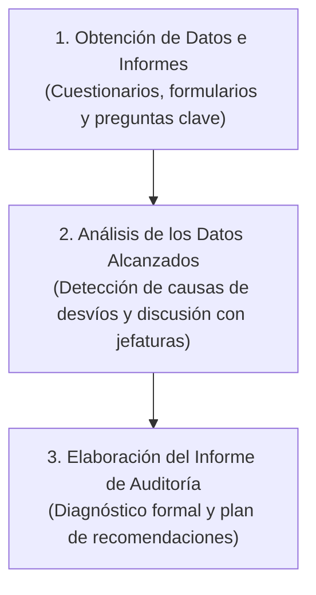

# 📘 Vega Falcón y cols. — Auditoría de Recursos Humanos

* **Texto de Referencia**: *Auditoría de Recursos Humanos* (Ecoe Ediciones / Universidad de Matanzas).
* **Autores**: Vladimir Vega Falcón, Sharon Álvarez Gómez, Daylin Medina Nogueira y Wilson Salas Álvarez.
* **Unidad**: Unidad 2 — Auditoría y Control de Recursos Humanos.
* **Cátedra**: Gestión de Recursos Humanos III.

---

## 🧭 1. Concepto y Enfoque No Punitivo

Los autores definen la **Auditoría de Recursos Humanos** como:

> El conjunto sistemático de procedimientos analíticos y de diagnóstico técnico ejecutado para examinar el cumplimiento de los planes, políticas, normativas laborales y programas de gestión humana, verificando el ajuste del personal a sus cargos y promoviendo la **mejora continua de la productividad y el control interno**.

### 🎓 La Confluencia Disciplinaria y el Rol Educativo
* **Interdisciplina**: La auditoría de personal es el punto de encuentro entre la **Economía** (costos laborales y productividad), la **Psicología Social** (motivación, liderazgo, clima laboral) y la **Sociología Laboral** (relaciones de poder, convenios colectivos).
* **Carácter No Punitivo (Clave de Cátedra)**: La cátedra remarca enérgicamente que la auditoría **no es una cacería de brujas ni un sumario judicial**. Su propósito no es castigar personas, sino detectar fallas en los procesos organizacionales para emitir **recomendaciones pedagógicas y constructivas** que permitan a la empresa aprender y perfeccionarse.

---

## 👤 2. Atributos y Postura del Auditor de RRHH

Vega Falcón y su equipo destacan que el perfil del auditor define el éxito de la intervención:
* **La Regla de Oro**: El auditor debe recordar que tiene **"dos oídos y una sola boca"**: debe escuchar activamente y recabar evidencias antes de emitir opiniones.
* **Competencias**: Alta formación técnica en leyes laborales, técnicas de entrevista y capacidad de análisis deductivo.
* **Actitud Colaborativa**: Debe ser empático y dialoguista. Las posturas arrogantes, fiscalizadoras o intimidatorias generan resistencias y falseamiento de datos por parte de los trabajadores.

---

## 🔄 3. Las Tres Etapas del Proceso de Auditoría

1. **Obtención de Datos e Informes**: Diseño de formularios estructurados y formulación de preguntas sistemáticas: *¿Qué se hace? ¿Por qué se hace? ¿Cómo se hace? ¿Cuándo se hace? ¿Dónde se hace? ¿Quién lo hace?*
2. **Análisis de los Datos Alcanzados**: Contraste de la evidencia contra presupuestos y normas legales, deducción de las causas primarias del problema y discusión preliminar con los responsables de línea.
3. **Elaboración del Informe de Auditoría**: Redacción del dictamen técnico con la cuantificación de daños económicos, riesgos jurídicos y recomendaciones priorizadas.

---

## 🛠️ 4. Los Cinco Enfoques de Investigación en Auditoría

Para auditar el área de personal, los autores proponen cinco enfoques complementarios:

| Enfoque de Investigación | Metodología Aplicada | Utilidad Práctica |
| :--- | :--- | :--- |
| **1. Enfoque Comparativo (*Benchmarking*)** | Contrasta a la organización con otra entidad análoga de alto desempeño en el mismo sector. | Evalúa si las tasas de rotación, ausentismo o salarios son competitivos en el mercado. |
| **2. Consultoría Externa** | Emplea como patrón de referencia los estándares fijados por consultores o publicaciones especializadas. | Útil para evaluar políticas salariales o de beneficios frente a normas internacionales. |
| **3. Enfoque Estadístico** | Elabora medias, dispersiones y coeficientes a partir de los propios registros históricos de la empresa. | Permite medir tendencias internas de ausentismo o siniestralidad a lo largo del tiempo. |
| **4. Enfoque Retrospectivo de Logros** | Audita expedientes pasados (contratos de trabajo, legajos, recibos de haberes, actas paritarias). | Verifica el estricto cumplimiento de las leyes laborales y previene contingencias judiciales. |
| **5. Evaluación por Objetivos** | Compara el rendimiento real alcanzado contra las metas explicitadas en el plan de RRHH. | Audita el grado de cumplimiento de los objetivos pactados con las gerencias. |

---

## 🏢 5. Auditoría Interna vs. Auditoría Externa

* **Auditoría Interna**: Llevada a cabo por profesionales de la propia empresa ("el control de los controles"). Es económica y cuenta con un conocimiento profundo de la cultura interna, pero corre el riesgo de perder imparcialidad o tolerar vicios por complacencia.
* **Auditoría Externa**: Contratada a firmas de consultores independientes. Brinda **máxima objetividad, rigor técnico y confidencialidad**, aunque conlleva un costo económico sensiblemente mayor.

---

## 📑 6. Estructura y Segmentación del Informe Final de Auditoría

El informe de auditoría no debe ser genérico; los autores exigen segmentarlo según las necesidades de los tres niveles destinatarios:

1. **Informe para Gerentes de Línea**:
   * Detalla las responsabilidades de personal de su sector específico.
   * Evalúa cómo realiza las entrevistas, el clima de su equipo y el uso de los planes de capacitación.
   * Señala irregularidades normativas inmediatas y propone acciones correctivas prácticas.
2. **Informe para Especialistas de Recursos Humanos**:
   * Aporta retroalimentación técnica minuciosa sobre los subsistemas de RRHH (selección, evaluación, compensaciones).
   * Diagnostica la actitud de los jefes de línea hacia los programas de personal.
3. **Informe para la Dirección General (Cúpula Ejecutiva)**:
   * Presenta un diagnóstico estratégico integral del clima y de la fuerza laboral.
   * Evalúa el grado de cumplimiento de los objetivos corporativos del área de personas.
   * Alerta sobre contingencias legales graves y ofrece un plan de acción priorizado por impacto económico.
