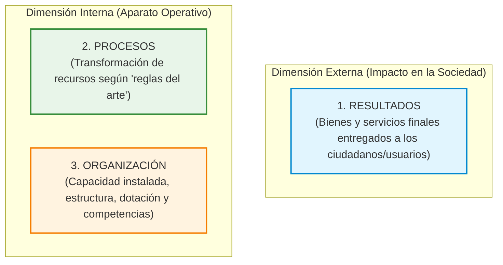

# 📘 Jorge Hintze — Control y Evaluación de Gestión y Resultados

* **Texto de Referencia**: *Control y evaluación de gestión y resultados de gestión* (Documentos TOP — Centro de Desarrollo y Asistencia Técnica en Tecnología de Organización Pública, 1999).
* **Autor**: Jorge Hintze.
* **Unidad**: Unidad 2 — Auditoría y Control de Recursos Humanos.
* **Asignatura**: Gestión de Recursos Humanos 3.

---

## 🧭 1. Distinciones Conceptuales Fundamentales

Jorge Hintze inicia su marco teórico estableciendo una delimitación epistemológica y operativa rigurosa entre tres conceptos que el sentido común y la práctica burocrática suelen confundir: **Información**, **Control** y **Evaluación**.

### A. Información
* **Definición**: Es la representación codificada de la realidad empírica mediante algún tipo de lenguaje simbólico (escrito, gráfico, numérico o digital).
* **Diferencia entre Datos e Información**: 
  * Los **datos** son registros directos, primarios, aislados y descontextualizados de los hechos (por ejemplo, el registro nominal de una fichada a las 08:02 o el número "8 agentes"). Por sí mismos no explican causalidad ni permiten fundamentar una intervención.
  * La **información**, en cambio, es el resultado de procesar, estructurar, clasificar, contextualizar y dotar de significado intencional a esos datos para un usuario o decisor determinado. La información reduce la incertidumbre y habilita el juicio de gestión.

### B. Control
* **Definición**: Consiste en verificar los hechos registrados por la información, comparándolos de manera objetiva contra un **patrón técnico de referencia preestablecido** (estándar, norma reglamentaria, especificación técnica, procedimiento estandarizado o meta de rendimiento).
* **Naturaleza Técnica y Continua**: Es una operación estrictamente técnica, objetiva y libre de juicios de valor moral o axiológico. El control no dictamina si una meta es "justa" o "buena"; simplemente constata si el hecho observado se adecúa o se desvía del parámetro prefijado. Además, el control puede operar de forma continua: *ex ante* (preventivo), *concurrente* (durante el proceso) o *ex post* inmediato.

### C. Evaluación
* **Definición**: Se sitúa en un plano cualitativo superior. Implica la emisión de **juicios de valor** (explícitos o implícitos) al contrastar la información y los desvíos detectados con **patrones de referencia valorativos**, expectativas sociales, mandatos políticos o criterios de bien común.
* **Naturaleza Calificativa y Posterior**: Mientras el control verifica conformidad técnica, la evaluación califica la pertinencia social y el impacto: determina si un resultado es *favorable o desfavorable*, si *satisface o no* las necesidades ciudadanas, o si la organización está legitimando su misión pública. Se lleva a cabo habitualmente al finalizar un ciclo productivo o programa de gestión.

---

## 🏛️ 2. Los Tres Objetos de Información, Control y Evaluación

Hintze plantea que en cualquier organización pública o privada existen tres objetos de análisis sobre los cuales recaen los sistemas de información, los parámetros de control y los juicios de evaluación:



### Matriz Estructural de Hintze

| Objeto de Gestión | Nivel de Información | Nivel de Control (Técnico) | Nivel de Evaluación (Valorativo) |
| :--- | :--- | :--- | :--- |
| **1. Resultados** *(Hacia afuera)* | Registros cuantitativos y cualitativos de los bienes y servicios entregados (volumen de trámites resueltos, pacientes atendidos, alumnos egresados). | Comparación contra las metas de producción física prefijadas y estándares de calidad pactados en el plan. | Valoración del impacto social, satisfacción de las necesidades comunitarias y efectividad de la política pública. |
| **2. Procesos** *(Hacia adentro)* | Registros sobre la secuencia temporal, insumos consumidos, costos incurridos y métodos de trabajo aplicados. | Comparación contra las **"reglas del arte"** profesionales, normas de seguridad y tiempos estándar de ciclo operativo. | Juicio sobre la razonabilidad económica, la economía de los recursos, la erradicación del despilfarro y la eficiencia productiva. |
| **3. Organización** *(Hacia adentro)* | Inventario de la capacidad instalada: organigrama, puestos de trabajo, perfiles de competencias, dotación de personal y tecnologías disponibles. | Comparación contra normas de dotación óptima, perfiles profesiográficos de cargo y manuales de funciones. | Juicio sobre la idoneidad institucional, la flexibilidad estructural, la salud del clima laboral y la racionalidad del diseño organizativo. |

---

## 📈 3. Evolución Institucional de las Prácticas de Control

Las instituciones no adoptan de inmediato sistemas de control avanzados. Hintze teoriza una evolución histórica e institucional en cuatro etapas:

1. **Fase Inicial (Control Jerárquico Individual)**:
   * El control es ejercido de forma directa, visual y personal por los jefes y supervisores de línea.
   * Depende enteramente de la presencia física y la discrecionalidad del supervisor inmediato.
   * Carácter reactivo, informal y de escaso alcance analítico.
2. **Fase Intermedia Jerárquica (Diferenciación de Especialistas)**:
   * La dirección crea dependencias funcionales específicas dedicadas al control: auditorías internas, departamentos de inspección, áreas de control de gestión.
   * El control se formaliza en rutinas y manuales de procedimientos, reportando directamente a la cúspide piramidal.
3. **Fase Intermedia Participativa (Transversalidad y Colegiación)**:
   * Se incorporan mecanismos participativos y transparentes: comités de auditoría paritarios, evaluación del desempeño entre pares, audiencias públicas y rendición periódica de cuentas.
   * La responsabilidad del control deja de ser monopolio de una oficina y se democratiza en la cultura de trabajo.
4. **Fase Avanzada (SICE — Sistemas Institucionales de Control y Evaluación)**:
   * Se consolida un **metasistema integrado** que articula tecnologías de información y comunicación con pautas culturales de autorregulación.
   * La información fluye en tiempo real, permitiendo la detección automática de desvíos, la corrección inmediata y la evaluación de impacto multidimensional.

---

## 🧠 4. Sistemas de Gestión (SG) vs. Sistemas de Información, Control y Evaluación (SICE)

Hintze utiliza una célebre **analogía biológica** para distinguir las dos grandes estructuras que conviven en una organización:

* **Sistemas de Gestión (SG)**:
  * Equivalen a los **músculos, órganos y articulaciones** del cuerpo humano.
  * Son los procesos de producción directa donde se captan insumos, se operan maquinarias, se atienden personas y se generan bienes y servicios.
* **Sistemas de Información, Control y Evaluación (SICE)**:
  * Constituyen el **sistema nervioso central** de la organización (un *metasistema*).
  * No producen bienes ni atienden clientes por sí mismos; su labor consiste en transmitir impulsos nerviosos: captar datos, registrar desvíos respecto a los parámetros de equilibrio (homeostasis), alertar a los centros de decisión y regular la energía del sistema productivo para evitar el colapso.

---

## 🔗 5. Articulación entre Niveles de Planificación y Control/Evaluación

El tipo de control o evaluación que debe aplicarse depende indefectiblemente del nivel jerárquico de la planificación:

```
[ Nivel de Políticas Públicas ]  ────────►  Evaluación de Impacto / Efectividad Social y Política
[ Nivel de Planes Estratégicos ] ────────►  Evaluación de Resultados Institucionales y Misión
[ Planificación Operativa ]      ────────►  Control de Productos (Eficacia Técnica y Estándares)
[ Programación de Tareas ]       ────────►  Control de Procesos (Eficiencia y "Reglas del Arte")
```

---

## 🎓 6. Énfasis de Cátedra y Clases Desgrabadas (Tips de Examen)

A partir del análisis exhaustivo del cuaderno de clases desgrabadas de la cátedra de **Gestión de Recursos Humanos 3**, se destacan los siguientes ejes centrales:

### ⚠️ Estado del Texto en el Calendario de Exámenes (Aviso Vital)
> **Condición de Examen:** Las profesoras María Laura Cabezas y Débora explicaron en clase que el texto de Jorge Hintze (Texto 15 del programa) **no se llegó a desarrollar íntegramente en las clases sincrónicas del cuatrimestre, por lo cual NO ingresa en la evaluación del Primer Parcial**.  
> **Sin embargo, entra obligatoriamente en la mesa del Examen Final.** Los alumnos deben dominar sus conceptos para la instancia final de acreditación.

### 🚗 La Diferencia entre Control y Evaluación a través del Ejemplo de Clase
Para erradicar la confusión terminológica, la cátedra utiliza dos analogías cotidianas que suelen ser motivo de preguntas conceptuales:
* **El Ejemplo del Auto Roto:**
  * Si a un conductor se le rompe el vehículo en medio de la ruta y no puede continuar su viaje, realiza una **evaluación** subjetiva y cualitativa: _"El auto es pésimo, no sirve más, me dejó a pata"_.
  * En cambio, cuando el automóvil ingresa al taller mecánico, el especialista aplica un **control técnico**: utiliza instrumentos de diagnóstico, compara presiones, voltajes o piezas mecánicas contra los manuales del fabricante y determina con parámetros objetivos: _"Se cortó el cable de embrague o falló el solenoide de arranque"_.
* **El Ejemplo del Control Médico:**
  * Un médico no evalúa intuitivamente si el paciente está _"lindo o feo"_; realiza un **control** mediante parámetros e indicadores técnicos universales: mide la tensión arterial (parámetro estándar: 120/80 mmHg), toma la frecuencia cardíaca, pesa en balanza calibrada y analiza los valores de glucemia en sangre.

### 📌 Los Conceptos Ineludibles para la Evaluación
1. **Diferenciación estricta entre Dato e Información:** El dato es la medida primaria nominal desprovista de sentido; la información es el dato interpretado, procesado y contextualizado para la toma de decisiones.
2. **Las "Reglas del Arte" en el Control de Procesos:** En el control de procesos no sólo se mide el tiempo o el dinero; se fiscaliza que las tareas profesionales y técnicas se ejecuten conforme a las mejores prácticas y protocolos vigentes del oficio o disciplina.
3. **El Personal dentro del Objeto "Organización":** La gestión del talento humano es el pilar central de la capacidad instalada. Auditar el subsistema de personal significa verificar si las dotaciones, competencias y perfiles coinciden con las necesidades estratégicas de la entidad.
