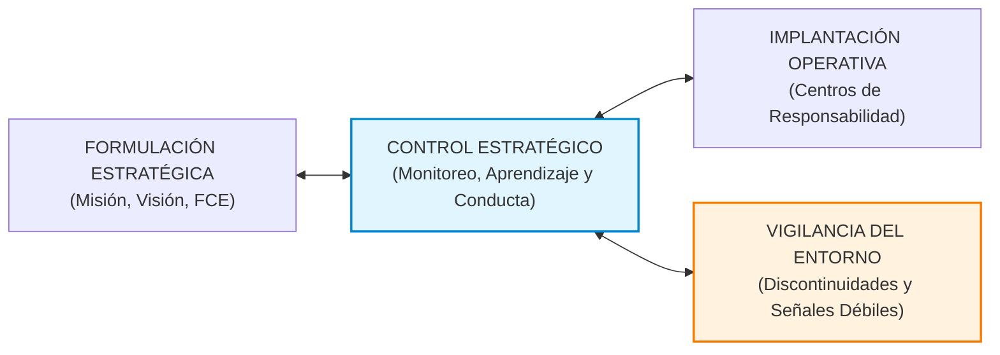
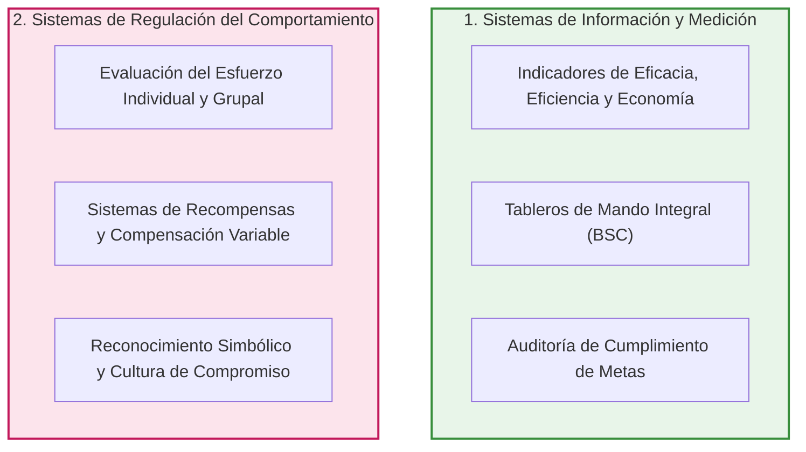

# 📘 Naranjo Pérez, Mesa Espinosa y Solera Salas — El Control Estratégico

* **Texto de Referencia**: *El control estratégico. Lo que no debemos obviar*.
* **Autores**: Remberto Naranjo Pérez, María Antonieta Mesa Espinosa y José Solera Salas.
* **Unidad**: Unidad 2 — Auditoría y Control de Recursos Humanos.
* **Asignatura**: Gestión de Recursos Humanos 3.

---

## 🧭 1. Naturaleza y Génesis del Control Estratégico

Naranjo Pérez y su equipo ubican el nacimiento del **Control Estratégico** como una respuesta directa y obligada a la evolución de la Dirección Estratégica en las últimas décadas del siglo XX. En contextos caracterizados por la turbulencia ambiental, la globalización, la hipercompetencia y la incertidumbre, los mecanismos tradicionales de control presupuestario y contable resultaron completamente insuficientes.

Los autores sostienen que el control estratégico no constituye una mera fase cronológica final que se limita a auditar números al cierre del ejercicio, sino un **proceso directivo permanente, dinámico y transversal** que acompaña la concepción, ejecución y reformulación de la estrategia en todos los niveles organizacionales.



---

## ⚖️ 2. Control Tradicional vs. Control Estratégico

Para comprender el cambio de paradigma, los autores contraponen las características del control operativo convencional frente al control estratégico:

| Criterio Metodológico | Control Tradicional / Operativo | Control Estratégico |
| :--- | :--- | :--- |
| **Enfoque Temporal** | **Retrospectivo**: Mira hacia el pasado para comparar lo ejecutado contra lo presupuestado. | **Prospectivo y Preventivo**: Se proyecta hacia el futuro, monitoreando tendencias y escenarios cambiantes. |
| **Variables de Análisis** | Cuantitativas, numéricas, financieras y cerradas a nivel departamental. | Cualitativas y cuantitativas, multidimensionales y abiertas al ecosistema organizacional. |
| **Relación con el Entorno** | Organización como sistema cerrado; el entorno exterior es ignorado o considerado estático. | Organización como sistema abierto; incorpora un **subsistema de vigilancia y alerta temprana**. |
| **Mecanismo de Corrección** | Corrección mecanicista de desvíos mediante órdenes jerárquicas y penalización. | **Aprendizaje organizacional**, replanteo de supuestos estratégicos y alineación cultural. |
| **Alcance Institucional** | Restringido a puestos de supervisión y oficinas administrativas de auditoría. | **Generalizado y descentralizado**: compromete a la totalidad de los miembros de la empresa. |

> *"El control estratégico no es un instrumento de persecución burocrática, sino un dispositivo directivo para aprender del entorno y traducir la estrategia corporativa en conductas concretas de los colaboradores."*

---

## 🔭 3. El Monitoreo del Entorno y la Vigilancia Estratégica

En entornos dinámicos, las hipótesis sobre las cuales se diseñó la estrategia pueden perder validez con rapidez. Por ello, el control estratégico institucionaliza la **vigilancia del entorno**:
* **Detección de señales débiles**: Captación temprana de cambios incipientes en la legislación laboral, transformaciones en la demanda ciudadana, innovaciones tecnológicas disruptivas o movimientos de la competencia.
* **Flexibilidad y reformulación**: Permite a la alta dirección cuestionar las premisas iniciales del plan y recalculación oportuna de las metas antes de que las desviaciones devengan en crisis irreversibles.

---

## 👤 4. El Perfil del Controlador Estratégico y el Factor Humano

El funcionamiento del control estratégico no depende exclusivamente del software o los tableros de mando, sino de las competencias y actitudes de los líderes:

### Cualidades Esenciales del Controlador Estratégico
1. **Voluntad Estratégica**: Firmeza para mantener el foco en los objetivos de largo plazo y resistir las urgencias y presiones operativas del día a día.
2. **Orientación activa al Cambio**: Disposición constante para cuestionar rutinas obsoletas y fomentar la innovación en los procesos de trabajo.
3. **Tolerancia constructiva al Error**: Comprensión de que el error no debe penalizarse con afán punitivo, sino capitalizarse como insumo de aprendizaje y perfeccionamiento profesional.

---

## 👥 5. Las Dos Grandes Categorías de Control (Johnson y Scholes)

Uno de los marcos más valorados por los autores (y solicitado recurrentemente por el equipo docente) es la clasificación de Gerry Johnson y Kevan Scholes, quienes dividen el control estratégico en dos grandes subsistemas interdependientes:



1. **Sistemas de Información y Medición de Desempeño**:
   * Centrados en la verificación cuantitativa y cualitativa del cumplimiento de los propósitos estratégicos.
   * Diseñan baterías de indicadores (KPIs) sobre rentabilidad, cobertura, productividad y niveles de servicio.
2. **Sistemas de Regulación del Comportamiento de las Personas**:
   * Reconocen que las estrategias fracasan si las personas no modifican sus conductas cotidianas.
   * Emplean la **evaluación del esfuerzo** y los **sistemas de recompensas** (incentivos salariales, planes de carrera, reconocimiento público y clima institucional) para premiar las conductas que materializan la visión de la entidad.

---

## 🏢 6. Tres Niveles de Diseño del Control Estratégico

El control debe distribuirse de forma articulada en los tres estratos organizacionales:

* **Nivel Estratégico (Alta Dirección / Gerencia General)**:
  * Control de largo plazo enfocado en la viabilidad institucional, la coherencia de las políticas globales y la asignación global del presupuesto.
* **Nivel Táctico (Gerencias de Área y Mandos Medios)**:
  * Control de mediano plazo centrado en la coordinación entre departamentos funcionales (ej. articulación entre RRHH, Producción y Finanzas) y la ejecución de programas sectoriales.
* **Nivel Operativo (Supervisión de Primera Línea y Equipos de Base)**:
  * Control administrativo continuo y de muy corto plazo (frecuencia diaria o semanal), orientado a fiscalizar tareas específicas y resolver desvíos de manera inmediata.

### Los Centros de Responsabilidad
Para evitar la imposición autoritaria de metas desde la cúpula, la organización moderna se segmenta en **Centros de Responsabilidad**: unidades operativas con autonomía suficiente para **negociar, consensuar y autogestionar sus propios indicadores de control**, generando un sentido de corresponsabilidad directa en los resultados.

---

## 🎯 7. Factores Clave de Éxito (FCE) y el Modelo de Philippe Lorino

Para no caer en la *infoxicación* (medir cientos de datos irrelevantes que paralizan la gestión), Naranjo Pérez recupera la metodología de Philippe Lorino para construir **Puntos Críticos de Control**:

### Las Cuatro Etapas para la Determinación de los Factores Clave:
1. **Primera Etapa — Recopilación de Actividades**: Mapeo exhaustivo de todas las tareas y operaciones que participan en los procesos institucionales.
2. **Segunda Etapa — Determinación de Actividades Específicas**: Identificación de los procesos que agregan valor y diferencian a la entidad.
3. **Tercera Etapa — Elección de las Actividades Más Efectivas**: Selección priorizada de los factores críticos que aseguran la supervivencia y el éxito.
4. **Cuarta Etapa — Análisis de la Eficiencia Global del Sistema**: Establecimiento de la batería final de indicadores de control.

```
[ Factores Clave de Éxito (FCE) ]
               ↓
[ Determinación de Actividades Críticas ]
               ↓
[ Detección de Inductores de Eficiencia ]
  (Causas primarias: competencias, motivación y clima humano)
               ↓
[ Construcción de Indicadores Clave de Control ]
```

* **El Personal como Inductor de Eficiencia**: Los autores demuestran que las competencias laborales, la motivación del personal y la satisfacción en el puesto constituyen los principales **inductores de eficiencia** que sustentan el rendimiento de cualquier tecnología o proceso operativo.

---

## 🎓 8. Énfasis de Cátedra y Clases Desgrabadas (Tips de Examen Parcial)

El cuaderno de clases de las profesoras María Laura Cabezas y Débora aporta especificaciones concretas sobre este texto:

### ⚠️ Estado del Texto en el Primer Parcial (¡Lectura Obligatoria!)
> **Condición de Examen:** A diferencia del texto de Hintze, el artículo de Naranjo Pérez y cols. **ENTRA OBLIGATORIAMENTE en el Primer Parcial**.  
> Las docentes remarcan que es un artículo condensado de solo 5 páginas que sintetiza el espíritu del control moderno, por lo cual es una **fuente predilecta para confeccionar consignas de examen**.

### 📝 Preguntas Típicas de Examen Señaladas por las Profesoras
1. **Los Tres Niveles de Diseño del Control Estratégico:** Explicar detalladamente el nivel Estratégico (alta dirección/políticas), el nivel Táctico (mandos medios/coordinación) y el nivel Operativo (corto plazo/tareas cotidianas frecuentes).
2. **Las Dos Categorías de Control:** Explicar por qué el control no se agota en medir números (categoría de información/medición) y cómo opera la categoría de **regulación de conducta mediante el sistema de recompensas** para motivar al personal.
3. **Las 4 Etapas del Conocimiento de los Factores Clave del Éxito:** Describir la secuencia metodológica desde la recopilación general de actividades hasta el análisis de eficiencia global.
4. **¿Por qué los Recursos Humanos son "Inductores de Eficiencia"?:** Demostrar que los indicadores financieros o de producción dependen directamente del nivel de competencias, compromiso y clima que ostente el equipo humano.

### 🚫 Advertencias de Corrección Docente
* **No contestar con sentido común ni lenguaje coloquial:** Las docentes advierten que muchos estudiantes desaprueban o reciben notas bajas (4 o 5) porque responden este texto de manera "coloquial" diciendo que _"el control estratégico es controlar que todo salga bien a largo plazo"_. Exigen utilizar los términos técnicos: *vigilancia del entorno, señales débiles, centros de responsabilidad, inductores de eficiencia y regulación de conductas*.
