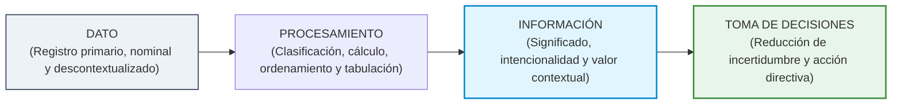
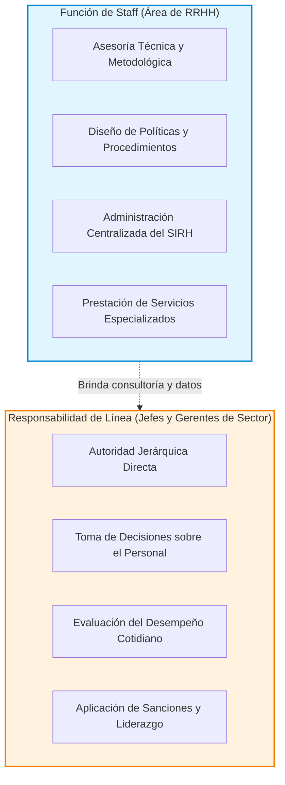

# 📘 Idalberto Chiavenato — Sistemas de Información y Control de RRHH

* **Texto de Referencia**: *Administración de Recursos Humanos: El capital humano de las organizaciones* (Capítulo 16: "Sistema de información de recursos humanos y auditoría de recursos humanos", McGraw-Hill).
* **Autor**: Idalberto Chiavenato.
* **Unidad**: Unidad 2 — Auditoría y Control de Recursos Humanos.
* **Asignatura**: Gestión de Recursos Humanos 3.

---

## 🧭 1. Datos vs. Información: La Cadena de Procesamiento

Idalberto Chiavenato construye el marco de referencia que la cátedra adopta como doctrina base para distinguir el insumo elemental del producto cognitivo útil para la gestión:



* **Dato**: Es un elemento primario, un evento cuantitativo o cualitativo, un valor nominal o el registro directo de un hecho que, por sí solo, **carece de significado amplio, juicio de valor o cualidad contextual**. Un dato aislado (por ejemplo, el número "8", o una marca horaria "08:02" en un reloj biométrico) no permite adoptar una decisión estratégica ni explica un problema de gestión.
* **Información**: Es el resultado tangible de recolectar, clasificar, ordenar, tabular y procesar esos datos dispersos, otorgándoles **significado, intencionalidad, contexto y propósito para el receptor**. La información reduce la incertidumbre del directivo y habilita la toma de decisiones fundamentadas.

---

## 🗄️ 2. El Banco de Datos de Recursos Humanos

El **Banco de Datos** es un sistema articulado de acumulación y almacenamiento de registros lógicamente interconectados, diseñado para centralizar la memoria institucional, erradicar redundancias documentales y evitar la duplicación de archivos en distintos escritorios.

### Los Seis Registros Fundamentales del Banco de Datos de RRHH
1. **Registro de Personal (Inventario de Habilidades)**: Datos filiatorios, domicilio, títulos educativos, antecedentes de carrera, competencias evaluadas y trayectoria institucional de cada agente.
2. **Registro de Puestos**: Perfiles de competencias requeridas, descripciones de funciones, requisitos de ingreso y ocupantes actuales de cada posición del organigrama.
3. **Registro de Secciones / Departamentos**: Estructura de dotación por gerencias, unidades operativas, delegaciones regionales y centros de costo.
4. **Registro de Remuneraciones**: Sueldos básicos, adicionales de convenio, horas extras devengadas, retenciones impositivas/previsionales e historial salarial.
5. **Registro de Prestaciones Sociales**: Coberturas de obras sociales, seguros de vida colectivos, subsidios familiares y beneficios de bienestar laboral.
6. **Registros Especiales**: Candidatos evaluados en búsquedas de empleo, programas de capacitación en marcha y legajos disciplinarios con antecedentes de sanciones.

---

## ⚙️ 3. Los Tres Métodos de Procesamiento de Datos

Chiavenato clasifica la evolución tecnológica del procesamiento de datos en tres modalidades históricas:

1. **Método Manual**:
   * Trabajo artesanal basado en fichas de cartulina, legajos de papel, carpetas colgantes y planillas manuscritas.
   * *Desventajas*: Extremadamente lento, alta propensión a errores humanos de transcripción y grave vulnerabilidad física ante extravíos o siniestros.
2. **Método Semiautomático**:
   * Combina operaciones manuales con la asistencia de máquinas contables mecánicas o planillas de cálculo electrónicas (tipo Excel) aisladas.
   * *Desventajas*: No existe integración real en red; la actualización de un dato en un archivo no actualiza automáticamente los restantes.
3. **Método Automático (Sistemas Computarizados Integrados)**:
   * Los datos se ingresan una sola vez y se procesan a través de bases de datos relacionales en servidores centrales o en la nube.
   * *Ventajas*: Actualización simultánea en tiempo real, alta velocidad de cómputo, generación automática de reportes y consultas cruzadas inmediatas.

---

## 🖥️ 4. El Sistema de Información de Recursos Humanos (SIRH)

El **SIRH** es una red organizada de procedimientos informáticos, telecomunicaciones y bases de datos que abastece a la gerencia de información confiable, relevante y oportuna sobre el capital humano.

### Flujo Integral del SIRH (Input — Proceso — Output)
* **Entradas (Inputs)**: Marcaciones biométricas, partes médicos de inasistencia, resultados de evaluaciones del desempeño, postulaciones de empleo y comprobantes de gastos de capacitación.
* **Procesamiento**: Validación algorítmica, comparación contra normativas legales, cálculo matemático de retenciones e integración en matrices estadísticas.
* **Salidas (Outputs)**: Liquidación de haberes neta, tasas de rotación (*turnover*), coeficientes de ausentismo, curvas de accidentología laboral, reportes de productividad e informes oficiales para entes reguladores.

### 📌 La Doble Dimensión de RRHH: Responsabilidad de Línea y Función de Staff
Esta distinción conceptual es el núcleo de la doctrina de Chiavenato y un eje invariable de evaluación:



* **Responsabilidad de Línea**: Cada jefe, supervisor o gerente de departamento tiene la **autoridad de mando directa** sobre sus colaboradores; es quien asigna tareas, evalúa el rendimiento diario, gestiona las licencias y decide sobre su continuidad.
* **Función de Staff**: El departamento de Recursos Humanos opera como un **órgano de asesoría y consultoría interna**. No posee mando jerárquico directo sobre los empleados de otras áreas operativas. Su misión es diseñar normativas, custodiar el Banco de Datos, gestionar el SIRH y proveer asesoría técnica especializada a los gerentes de línea para que estos tomen decisiones acertadas.

---

## ⏰ 5. Control de la Jornada Laboral y Disciplina Progresiva

### Gestión de la Jornada Laboral
El SIRH contemporáneo no se limita a penalizar tardanzas, sino que administra esquemas de trabajo innovadores:
* *Horario Flexible (Flextime)*: Concurrencia obligatoria en horas pico centrales con bandas de entrada y salida móviles.
* *Semana Laboral Comprimida*: Cumplimiento de la carga semanal en menos días (ej. 4 jornadas de 10 horas).
* *Teletrabajo y Modelos Híbridos*: Control mediante objetivos, entregables y registro de conexión digital.
* *Banco de Horas*: Compensación pactada de horas extras por francos de descanso.

### De la Disciplina Coercitiva a la Disciplina Progresiva
Chiavenato sostiene que el castigo represivo unilateral genera rencor, desmotivación y sabotaje encubierto. Por ello, postula el fomento del **autocontrol** y, ante infracciones, la aplicación de la **disciplina progresiva**:

```
[ 1. Advertencia Verbal en Privado ]  ──►  Diálogo reflexivo sin registro formal inicial
                 ↓
[ 2. Advertencia Escrita Formal ]     ──►  Notificación fehaciente agregada al legajo
                 ↓
[ 3. Suspensión Temporal de Empleo ] ──►  Cesación transitoria de funciones sin goce de haberes
                 ↓
[ 4. Despido con Causa Justificada ] ──►  Extinción del vínculo tras agotar las instancias previas
```

---

## 🔄 6. Las Cuatro Etapas del Proceso de Control de RRHH

Chiavenato sintetiza el control administrativo en un ciclo sistémico compuesto por cuatro fases articuladas:

1. **Establecimiento de Estándares Deseados**:
   * Definición previa de patrones o normas de rendimiento en cuatro dimensiones: *Cantidad* (volumen de trabajo), *Calidad* (precisión, nivel de servicio), *Tiempo* (cumplimiento de plazos) y *Costo* (ejecución presupuestaria).
2. **Monitoreo del Desempeño Real**:
   * Recolección objetiva y sistemática de datos sobre las tareas realizadas a través del SIRH y las observaciones de línea.
3. **Comparación del Desempeño con los Estándares**:
   * Contraste técnico para calcular variaciones o desvíos, admitiendo un margen razonable de tolerancia operativa.
4. **Acción Correctiva**:
   * Implementación de medidas directivas para subsanar los desvíos significativos y reencauzar la operación conforme al estándar prefijado.

---

## 🎓 7. Énfasis de Cátedra y Clases Desgrabadas (Tips de Examen Parcial)

El análisis del cuaderno de clases desgrabadas de las docentes María Laura Cabezas y Débora revela los puntos de máxima exigencia para el Primer Parcial:

### ⚠️ Estado del Texto en el Primer Parcial (¡Tema Central!)
> **Condición de Examen:** El texto de Chiavenato **ENTRA PLENAMENTE en el Primer Parcial**. Es considerado el autor troncal de la Unidad 2 debido a que articula la técnica del dato con el control de gestión.

### 📝 Preguntas Clave de Examen Tomadas por el Equipo Docente
1. **Diferencia Conceptual entre Dato e Información con Ejemplo de Clase:**
   * *El ejemplo de las docentes:* Explicar que decir _"8 estudiantes"_ es un simple **dato**, un valor cuantitativo primario desprovisto de significado interpretativo. En cambio, decir _"8 estudiantes de la matrícula de 35 asistieron presencialmente a la clase de RRHH III en el aula de Viedma"_ constituye **información**, pues contextualiza la variable, cualifica el hecho y permite a la cátedra adoptar decisiones sobre la modalidad de transmisión y conectividad.
2. **Banco de Datos vs. Sistema de Información Pleno (Ejemplo del Sistema Tramitex):**
   * Las docentes explican que una base de datos estática no es sinónimo de un SIRH interactivo. Pusieron como ejemplo el sistema **Tramitex** de la administración pública provincial: permite consultar dónde está un expediente administrativo, pero no constituye un SIRH pleno porque no permite al usuario realizar cruces analíticos de variables de personal ni simular escenarios de dotación.
3. **Doble Función del SIRH: Responsabilidad de Línea vs. Función de Staff:**
   * Es una consigna clásica de examen parcial: el alumno debe explicar con precisión por qué la jefatura de personal asesora (staff) mientras que los gerentes de cada sector operativo ejercen el mando sobre sus equipos (línea).
4. **Las 4 Etapas del Ciclo de Control:**
   * Describir en orden riguroso: Estándares -> Monitoreo -> Comparación -> Acción Correctiva.

### 🚫 Advertencia de Corrección Docente
* **Vocabulario Técnico:** Las docentes exigen hablar con propiedad de *parámetros técnicos, desvíos, estándares de tolerancia, responsabilidad de línea y función de staff*. Explicar estos conceptos como _"el jefe que le dice al empleado qué hacer"_ o _"archivos de la computadora"_ invalida la respuesta.
