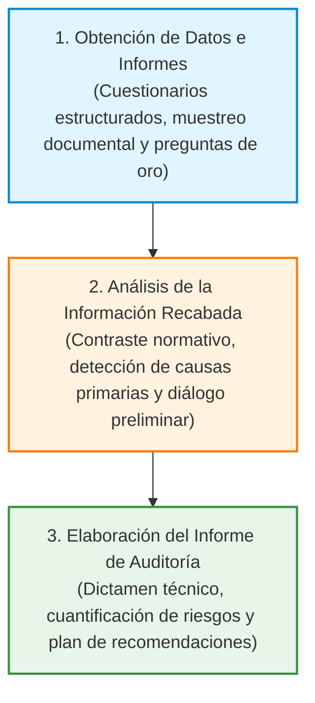
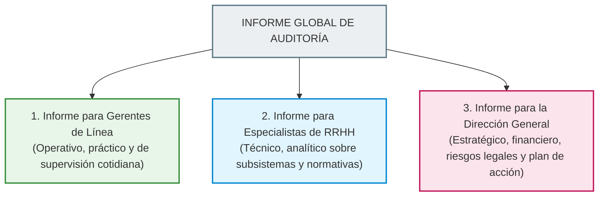

# 📘 Vega Falcón y cols. — Auditoría de Recursos Humanos

* **Texto de Referencia**: *Auditoría de Recursos Humanos* (Ecoe Ediciones / Universidad de Matanzas).
* **Autores**: Vladimir Vega Falcón, Sharon Álvarez Gómez, Daylin Medina Nogueira y Wilson Salas Álvarez.
* **Unidad**: Unidad 2 — Auditoría y Control de Recursos Humanos.
* **Asignatura**: Gestión de Recursos Humanos 3.

---

## 🧭 1. Concepto y Enfoque No Punitivo

Los autores definen la **Auditoría de Recursos Humanos** como:

> El conjunto sistemático, analítico y técnico de procedimientos evaluativos que examina de manera objetiva el cumplimiento de las políticas, normativas laborales, instructivos y programas de gestión humana, comprobando la adecuación de los trabajadores a sus puestos de trabajo y emitiendo un diagnóstico profesional con **recomendaciones formativas para la mejora continua del control interno y la productividad organizacional**.

### 🎓 Confluencia Disciplinaria y Carácter Pedagógico
* **Interdisciplinariedad**: La auditoría de personal no es un mero trámite administrativo ni contable. Confluyen en ella:
  * La **Economía Laboral**: evaluación del costo salarial, ratios de productividad y rentabilidad del capital humano.
  * La **Psicología Social**: análisis de las dinámicas grupales, la motivación, los estilos de liderazgo y el clima de trabajo.
  * La **Sociología de las Organizaciones y el Derecho Laboral**: verificación del cumplimiento de convenios colectivos, relaciones sindicales y prevención de litigiosidad jurídica.
* **Carácter Estrictamente No Punitivo (Regla de Oro de Cátedra)**:
  * La cátedra subraya que la auditoría **no es una inspección policial, una cacería de brujas ni un sumario sancionatorio**.
  * Su propósito esencial **no es castigar a las personas ni aplicar cesantías**, sino diagnosticar las fallas en los procesos y normativas para que la organización **aprenda de sus propios errores**, formule recomendaciones constructivas y perfeccione sus prácticas de gestión.

---

## 👤 2. Atributos y Postura del Auditor de RRHH

Vega Falcón y su equipo destacan que el éxito del proceso depende decisivamente del perfil técnico y actitudinal del auditor:

* **La Regla de Oro del Auditor**: El profesional debe recordar en todo momento que tiene **"dos oídos y una sola boca"**: su labor primordial consiste en escuchar activamente, observar el terreno y recabar evidencias objetivas antes de emitir opiniones o dictámenes apresurados.
* **Competencias Técnicas**: Dominio exhaustivo de la legislación laboral vigente, conocimiento de las técnicas de muestreo documental y destrezas para la conducción de entrevistas no intimidatorias.
* **Actitud Colaborativa y Dialógica**: El auditor debe mostrar empatía y apertura al diálogo. Las posturas arrogantes, fiscalizadoras o amenazantes generan temor en los trabajadores, lo que conduce al ocultamiento de desvíos y al falseamiento de datos.

---

## 🔄 3. Las Tres Etapas del Proceso de Auditoría

El desarrollo de la intervención se organiza en tres fases metodológicas secuenciales:

1. **Obtención de Datos e Informes**:
   * Recolección de evidencias mediante cuestionarios, entrevistas y revisión de legajos.
   * Formulación sistemática de las seis preguntas analíticas de oro: *¿Qué se hace? ¿Por qué se hace? ¿Cómo se hace? ¿Cuándo se hace? ¿Dónde se hace? ¿Quién lo hace?*
2. **Análisis de los Datos Alcanzados**:
   * Contraste de la información recopilada contra los manuales de procedimiento, presupuestos y leyes laborales.
   * Identificación de las causas raíz de las anomalías y discusión preliminar con los supervisores de sector para contrastar puntos de vista.
3. **Elaboración del Informe de Auditoría**:
   * Redacción formal del documento de diagnóstico, ponderación de riesgos y formulación de recomendaciones priorizadas.

---

## 🛠️ 4. Los Cinco Enfoques de Investigación en Auditoría

Los autores presentan cinco enfoques metodológicos complementarios para auditar la gestión de personal:

| Enfoque Metodológico | Descripción Técnica | Utilidad Práctica en la Gestión |
| :--- | :--- | :--- |
| **1. Enfoque Comparativo (*Benchmarking*)** | Contrasta las políticas y resultados de la propia empresa con los de otra entidad líder o similar del mismo sector de actividad. | Permite determinar si las tasas de rotación, el ausentismo o los paquetes salariales son competitivos en el mercado. |
| **2. Consultoría Externa** | Utiliza como patrón de comparación los estándares, baremos y modelos técnicos elaborados por consultoras especializadas u organismos internacionales. | Muy útil para rediseñar sistemas de compensación variable o implementar programas de bienestar con estándares de vanguardia. |
| **3. Enfoque Estadístico** | Construye series cronológicas, índices de correlación, medias y dispersiones a partir de los registros históricos del Banco de Datos interno. | Permite identificar tendencias temporales en siniestralidad laboral, ausentismo por patologías o horas extras crónicas. |
| **4. Enfoque Retrospectivo de Logros** | Examina una muestra representativa de expedientes concluidos (contratos firmados, legajos de personal, recibos de haberes, actas de licencias). | Verifica la conformidad jurídica de los actos administrativos y previene contingencias económicas y juicios laborales. |
| **5. Evaluación por Objetivos** | Contrasta los logros reales alcanzados por el área de personal frente a los objetivos y metas cuantitativas fijadas en el Plan Estratégico. | Audita el grado de cumplimiento de los compromisos asumidos ante la Dirección General. |

---

## 🏢 5. Auditoría Interna vs. Auditoría Externa

La cátedra exige conocer con precisión las características, pros y contras de cada modalidad:

| Criterio | Auditoría Interna | Auditoría Externa |
| :--- | :--- | :--- |
| **Ejecutores** | Profesionales del departamento de personal o cuerpo de inspectores propios de la entidad. | Auditores independientes, firmas consultoras o entes de control público ajenos a la organización. |
| **Costo Económico** | Significativamente menor; aprovecha los recursos humanos y salarios de la plantilla actual. | Elevado; requiere contratación de honorarios profesionales de consultoría externa. |
| **Conocimiento de la Cultura** | Muy alto; conocen la historia, las costumbres no escritas y los circuitos informales de la entidad. | Inicialmente bajo; requiere un período de familiarización y análisis preliminar del contexto. |
| **Grado de Objetividad** | **Vulnerable**: corre el riesgo de caer en la "ceguera de taller", compromisos personales o temor a represalias de superiores. | **Máximo**: garantiza total neutralidad, independencia de criterio, rigor metodológico y confidencialidad. |
| **Metodología de Trabajo** | Procesos de seguimiento continuo e intervenciones rutinarias ("el control de los controles"). | Intervención formal prefijada: notificación formal previa, cronograma estricto de días y trabajo de campo intensivo. |

---

## 📑 6. Estructura y Segmentación del Informe Final de Auditoría

Un informe de auditoría no debe ser una pieza monolítica e indiscriminada. Vega Falcón y su equipo proponen estructurar el producto final en **tres versiones segmentadas según el nivel decisorio del destinatario**:

1. **Informe para los Gerentes de Línea**:
   * Focalizado en las funciones directas de supervisión de su sector (evaluación de su equipo, ausencias, uso de horas extras y aplicación de descansos).
   * Identifica anomalías procedimentales inmediatas y ofrece recomendaciones prácticas para optimizar el liderazgo cotidiano.
2. **Informe para los Especialistas de Recursos Humanos**:
   * Contiene una devolución técnica detallada sobre la eficacia de cada subsistema de personal (reclutamiento, selección, inducción, capacitación y remuneraciones).
   * Evalúa el grado de aceptación de las políticas de RRHH por parte de los mandos medios.
3. **Informe para la Dirección General (Cúpula Institucional)**:
   * Síntesis ejecutiva de alto nivel orientada a la toma de decisiones estratégicas.
   * Diagnostica la salud del clima laboral global, evalúa el cumplimiento de las políticas de capital humano, advierte sobre contingencias legales de alto impacto patrimonial y establece un plan de inversiones prioritario.

---

## 🎓 7. Énfasis de Cátedra y Clases Desgrabadas (Tips de Examen Parcial)

El análisis del cuaderno de clases desgrabadas de las docentes María Laura Cabezas y Débora aporta lineamientos fundamentales sobre este texto:

### ⚠️ Estado del Texto en el Primer Parcial (¡Lectura Ineludible!)
> **Condición de Examen:** El texto de Vega Falcón y cols. **ENTRA OBLIGATORIAMENTE en el Primer Parcial**.  
> Las docentes recalcan que es la referencia principal sobre auditoría de personal en el programa y que sus consignas definen la nota de aprobación del parcial.

### 📝 Consignas Típicas de Examen Señaladas por las Profesoras
1. **Definición de Auditoría de RRHH y Justificación de su Carácter No Punitivo:**
   * Es una pregunta clásica: definir auditoría de personal y fundamentar por qué **bajo ninguna circunstancia debe considerarse una herramienta coercitiva, disciplinaria o de castigo**. Explicar que su finalidad es el *aprendizaje organizacional* mediante recomendaciones técnicas de perfeccionamiento.
2. **Comparación Rigurosa entre Auditoría Interna y Externa:**
   * Ventajas, desventajas, costo y, fundamentalmente, la cuestión de la **objetividad**: por qué la auditoría interna puede perder independencia por la cotidianeidad laboral y por qué la externa aporta neutralidad de criterio.
3. **El Producto Final: El Informe de Auditoría y sus Tres Destinatarios:**
   * Detallar las diferencias de enfoque y contenido entre el informe destinado a los Gerentes de Línea, a los Especialistas de RRHH y a la Dirección General.

### 🏥 El Ejemplo Real de Clase: Auditoría Externa en Hospitales y Universidades
Para ilustrar cómo se desarrolla una auditoría externa en el sector público, las profesoras narraron el caso real de las auditorías institucionales:
* Un equipo externo de auditores notifica su intervención con semanas de antelación y se instala durante 4 a 5 días hábiles en las dependencias de la entidad.
* Solicitan cajas enteras de legajos de personal, resoluciones de designación, ordenanzas de concursos, instructivos de equivalencias docentes y actas de exámenes.
* Durante la estadía, los auditores revisan documento por documento para verificar si la tramitación real se ajusta a la norma legal vigente, entrevistando a los jefes de sector y culminando con un informe de hallazgos y recomendaciones de ajuste procedimental.

### 🚫 Advertencia Estricta de Corrección
* **Error Eliminatorio:** Las docentes advirtieron que considerarán gravemente erróneo sostener que la auditoría de personal sirve para _"sancionar empleados rebeldes"_ o _"iniciar sumarios administrativos"_. Responder en esa línea implica perder la totalidad del puntaje asignado a la consigna.
