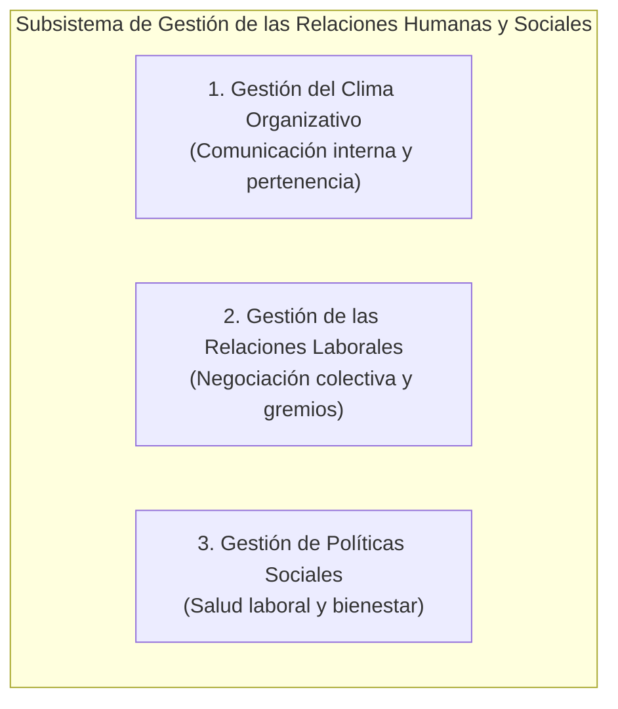

# 📘 Francisco Longo — Relaciones Humanas y Sociales en el Servicio Civil

* **Texto de Referencia**: *Marco Analítico para el Diagnóstico Institucional de Sistemas de Servicio Civil* (Págs. 42 a 45: "El Subsistema de Gestión de las Relaciones Humanas y Sociales", BID, 2002).
* **Unidad**: Unidad 3 — Relaciones Humanas y Sociales.
* **Cátedra**: Gestión de Recursos Humanos III.

---

## 🧭 1. Concepto y Objeto del Subsistema

Francisco Longo delimita este subsistema a partir de una distinción clave:
> El subsistema gestiona las relaciones entre la organización y sus empleados cuando las políticas y prácticas de personal adquieren una **dimensión colectiva**.

* A diferencia de las relaciones ordinarias de trabajo (que operan en el plano individual o de un puesto específico), aquí el interlocutor de la dirección no es el empleado singular, sino la **totalidad del personal o colectivos vinculados por identidades sociolaborales o profesionales genéricas**.
* **Articulación Transversal**: Se conecta e interactúa con todos los demás subsistemas de Recursos Humanos: Planificación, Organización del trabajo, Gestión del empleo, Rendimiento, Compensación y Desarrollo.

---

## 🏛️ 2. Estructura en Tres Bloques de Gestión

Longo organiza el subsistema en tres áreas operativas complementarias:

### 1. Gestión del Clima Organizativo
* **Comunicación Interna**: Despliegue de canales formales bidireccionales (ascendentes y descendentes) para asegurar que las políticas institucionales se comprendan y la dirección reciba las inquietudes de las bases.
* **Sentido de Pertenencia**: Aplicación de encuestas periódicas de clima para evaluar la satisfacción colectiva y reforzar la implicación de los servidores públicos en el proyecto institucional.

### 2. Gestión de las Relaciones Laborales (RRLL)
* **Negociación Colectiva**: Diálogo formal sobre salarios, regímenes horarios, condiciones de trabajo y derechos laborales.
* **Interlocución Social**: Relación sistemática con sindicatos, asociaciones gremiales y comités de delegados de base.

### 3. Gestión de Políticas Sociales
* **Salud Laboral**: Prevención de riesgos de trabajo, ergonomía y condiciones ambientales seguras.
* **Beneficios y Ayuda Social**: Programas de bienestar extendidos a grupos con necesidades específicas (familias, guarderías, asistencia médica).

---

## ⚠️ 3. Puntos Críticos en las Organizaciones Públicas

Longo identifica tensiones y debilidades recurrentes en la gestión pública:

1. **Déficit Crónico de Comunicación Interna**: En el Estado, los empleados suelen percibir que no son escuchados o que las decisiones directivas se transmiten con opacidad y demoras.
2. **Reactividad y Ausencia de Estrategia Laboral**: La gerencia pública suele actuar de forma reactiva (esperando a que estalle el conflicto gremial para negociar apuradamente), lo que debilita su capacidad directiva.
3. **Politización de las Relaciones Laborales**: Riesgo de que la dirección política asuma el rol patronal de forma partidaria, desdibujando la frontera técnica entre sindicato y administración.
4. **Ambigüedad Normativa y Mecanismos de Mediación**: Fricción entre la fijación unilateral de normas por el Estado y los acuerdos paritarios. Longo promueve la institucionalización de instancias de **mediación y arbitraje formal**.
5. **Sostenibilidad Fiscal de los Beneficios**: Las políticas sociales no deben entrar en colisión con la viabilidad presupuestaria ni constituir privilegios injustificados frente al mercado general.
