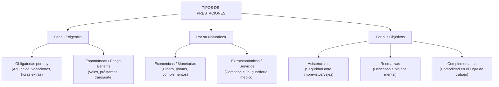

# 📘 Idalberto Chiavenato — Prestaciones, CVT y Relaciones Laborales

* **Texto de Referencia**: *Administración de Recursos Humanos* (Capítulos 11, 12 y 13, McGraw-Hill).
* **Unidad**: Unidad 3 — Relaciones Humanas y Sociales.
* **Cátedra**: Gestión de Recursos Humanos III.

---

## 🎁 PARTE A. Capítulo 11: Planes de Prestaciones Sociales

### 1. Concepto y Origen
Las prestaciones sociales son facilidades, conveniencias y servicios que las organizaciones ofrecen a sus empleados para satisfacer necesidades personales y familiares no cubiertas por el salario base.
* **Remuneración Directa**: El salario específico pactado por el puesto y cargo ocupado.
* **Remuneración Indirecta**: El paquete integral de prestaciones y beneficios extendido al conjunto de los colaboradores, con independencia de su jerarquía o función.

### 2. Clasificación Estructural de las Prestaciones

1. **Por su Exigencia Legal**:
   * *Legales u Obligatorias*: Impuestas por ley o convenios colectivos (aguinaldo/SAC, vacaciones pagas, prima de antigüedad, seguridad social básica).
   * *Espontáneas o Voluntarias*: Concedidas por liberalidad de la empresa para competir por el talento (vales de alimentos, seguro médico premium, fondo de ahorro).
2. **Por su Naturaleza Financiera**:
   * *Económicas (Dinerarias)*: Pagos directos en nómina, bonos vacacionales o reembolsos de gastos.
   * *Extraeconómicas (En Especie / Servicios)*: Comedor subsidiado, estacionamiento, guardería, atención médica en planta.
3. **Por sus Objetivos**:
   * *Asistenciales*: Buscan dar seguridad económica y médica ante emergencias al empleado y su familia (seguros de vida, planes de retiro, cobertura médica integral).
   * *Recreativas*: Proveen distensión, integración y descanso (club social, eventos deportivos, áreas recreativas en planta).
   * *Complementarias*: Brindan facilidades y comodidades directas para el desempeño diario (comedor, transporte corporativo, cafetería).

### 3. Fundamentos Teóricos y Principios de Costos
* **Articulación con Maslow y Herzberg**: Las prestaciones atienden necesidades primarias y sociales de Maslow, operando como **factores higiénicos** en la teoría bifactorial de Herzberg: *su ausencia genera insatisfacción, pero su presencia por sí sola no motiva permanentemente sin contenido en el puesto*.
* **Principio de Responsabilidad Mutua**: Los costos de los beneficios deben ser cofinanciados entre la empresa y el empleado. La gratuidad absoluta fomenta el paternalismo y reduce el valor percibido del servicio.
* **Principio del Rendimiento de la Inversión**: Todo plan social debe justificar un retorno medible en reducción de ausentismo, retención de talentos y elevación del clima laboral.

---

## 🛡️ PARTE B. Capítulo 12: Calidad de Vida en el Trabajo (CVT)

### 1. Higiene Laboral y Factores Ambientales (Ergonomía)
La higiene industrial previene el deterioro de la salud física y psicológica del trabajador frente a riesgos:
* **Físicos**: Ruido (medido en decibeles - db), vibraciones, temperaturas extremas y radiaciones.
* **Químicos**: Polvos, vapores tóxicos, gases y solventes industriales.
* **Biológicos**: Virus, bacterias y hongos.

#### Parámetros Ambientales Clave
* **Iluminación**: Se analiza según la exigencia visual de la tarea, clasificándose en *directa, indirecta, semidirecta y semiindirecta*.
* **Ruido**: La exposición crónica a niveles superiores a 85 db produce fatiga nerviosa, pérdida auditiva y desatención.
* **Ergonomía**: Adecuación del puesto, mobiliario e interfaces tecnológicas a las dimensiones anatómicas del ser humano.

### 2. Seguridad Laboral y Prevención de Accidentes
* **Accidente de Trabajo**: Suceso imprevisto que genera una lesión orgánica, perturbación funcional o muerte.
* **Causas Fundamentales**:
  * *Condiciones Inseguras*: Fallas mecánicas, falta de protecciones, pisos resbaladizos o cables expuestos en el entorno físico.
  * *Actos Inseguros*: Fallas humanas del trabajador (no usar casco o gafas, violar procedimientos de seguridad, imprudencia).
* **Comisión Paritaria de Higiene y Seguridad (CIPA / Comisión Mixta)**: Órgano integrado por representantes de los trabajadores y de la empresa para inspeccionar la planta, auditar riesgos e instruir en prácticas seguras.
* **Costo de los Accidentes**: La regla empírica establece que el **costo indirecto** (horas perdidas, daño a maquinarias, baja de moral, tiempo de investigación) cuadruplica el costo directo asegurado.

---

## 🤝 PARTE C. Capítulo 13: Relaciones con las Personas

### 1. Políticas de Relaciones Laborales con Sindicatos

Chiavenato identifica cuatro actitudes directivas frente al sindicalismo:

| Política de Relaciones | Postura de la Dirección | Consecuencias en la Organización |
| :--- | :--- | :--- |
| **1. Paternalista** | Aceptación rápida e indiscriminada de todas las demandas del gremio para evitar el conflicto a cualquier precio. | Genera indefensión en la línea, eleva costos de forma insostenible y fortalece al sindicato por refuerzo positivo. |
| **2. Autocrática** | Postura rígida y legalista; no concede nada fuera de la letra estricta de la ley y rechaza el diálogo. | Crea un clima de guerra permanente, fomenta la rebeldía, huelgas encubiertas y alta conflictividad. |
| **3. De Reciprocidad** | La alta cúpula pacta directamente con la cúpula sindical a espaldas de la estructura operativa. | Marginación de los supervisores y alejamiento de las bases; los problemas de planta quedan sin resolver. |
| **4. Participativa** | Diálogo institucional basado en datos técnicos, involucrando a la jefatura de línea en la resolución. | Construye corresponsabilidad sindical, previene huelgas y consolida la paz laboral de largo plazo. |

### 2. Medios de Acción Sindical y Patronal
* **Medios Sindicales Típicos**: La huelga (interrupción colectiva y voluntaria del trabajo) y los piquetes informativos.
* **Medios Sindicales Atípicos / Ilícitos**: Paro de brazos caídos, huelga de celo/por esmero (aplicación hiperestricta del reglamento que paraliza el flujo), tortuguismo (trabajo a paso lento), huelga relámpago y toma de planta.
* **Medios Patronales**: Cierre temporal de las instalaciones (*lockout*) y listas negras (práctica discriminatoria proscrita por ley).
