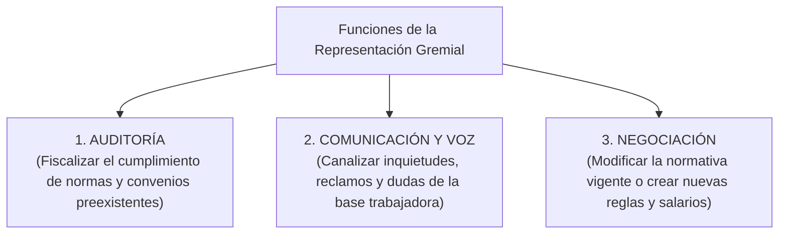

# 📘 Jorge Aquino y cols. — Relaciones Gremiales y Sindicales

* **Texto de Referencia**: *Recursos Humanos* (Capítulo 8: "Relaciones Gremiales", Ediciones Macchi).
* **Autores**: Jorge A. Aquino y equipo de colaboradores.
* **Unidad**: Unidad 3 — Relaciones Humanas y Sociales.
* **Cátedra**: Gestión de Recursos Humanos III.

---

## 🧭 1. Concepto y Rasgos Distintivos de las Relaciones Gremiales

Jorge Aquino define las relaciones gremiales como el conjunto articulado de actividades, comunicaciones y negociaciones llevadas a cabo entre los representantes sindicales y los representantes de la empresa con el propósito de **canalizar y resolver quejas, reclamaciones y acuerdos recíprocos**.

### Las Cinco Características Singulares
1. **Trato entre Representantes**: Quienes se sientan a la mesa negocian problemas de terceros. Poseen una visión global de la empresa que los trabajadores de base no tienen, lo cual genera el riesgo de que los negociadores se aíslen si no comunican fluidamente las conclusiones.
2. **Proyección en el Tiempo**: Los acuerdos laborales trascienden a las personas que los firmaron y perduran a lo largo de los años. Por ello, Aquino recomienda fijar **cláusulas explícitas de vigencia y caducidad temporal**.
3. **Relación de Poder**: Es un escenario de tensión estructural donde la empresa busca maximizar la **flexibilidad y rentabilidad operacional**, mientras que el sindicato busca **restringir la discrecionalidad patronal** y tutelar derechos adquiridos.
4. **Acuerdos sin Consenso Pleno**: Rara vez se alcanza la unanimidad absoluta. El sindicato suele resolver por votación de mayorías internas y la empresa por el principio de autoridad ejecutiva.
5. **Complicaciones Intersindicales**: Dinámicas complejas generadas por disputas entre centrales obreras (ej. CGT vs. CTA) o fisuras internas entre la comisión interna de delegados de planta y la conducción del sindicato central.

---

## 🏛️ 2. Las Tres Funciones Típicas de la Representación Gremial

Aquino desglosa el rol del delegado y dirigente sindical en tres funciones bien diferenciadas:

1. **Función de Auditoría**: Monitorear que la patronal cumpla estrictamente la legislación vigente, el Convenio Colectivo de Trabajo (CCT), los reglamentos internos de fábrica y los usos y costumbres de planta.
2. **Función de Comunicación y Voz**: Actuar como canal de expresión legítimo para evacuar dudas ante cambios tecnológicos, reestructuraciones o vacíos informativos que generan incertidumbre.
3. **Función de Negociación**: Crear nuevas condiciones de trabajo o actualizar las existentes (acuerdos salariales, categorías profesionales, licencias gremiales, adicionales por productividad).

---

## ⚖️ 3. Los Dos Estilos de Gestión desde Recursos Humanos

El área de Recursos Humanos puede encarar las relaciones laborales desde dos posturas contrapuestas:

| Dimensión de Análisis | Política de Liderazgo (Autoritaria) | Política Legalista (Participativa) |
| :--- | :--- | :--- |
| **Rol de RRHH** | **"Dueño"** del tema: El gerente de RRHH negocia directamente y despoja a los jefes de línea de la conducción del personal. | **"Asesor"**: RRHH capacita, respalda y acompaña a los jefes de línea para que ellos mismos lideren a sus equipos. |
| **Tipo de Negociación** | Acuerdos cerrados y casuísticos ("caso por caso"). No se labran actas para evitar precedentes. | Negociaciones abiertas y regladas. Se labran actas formales que sientan precedentes transparentes. |
| **Fundamentación** | Subjetiva, personalista, basada en el carisma o la presión personal del negociador. | Objetiva, fundada en la ley, el convenio colectivo y datos técnicos demostrables. |
| **Participación de la Línea** | Nula: Los supervisores se enteran de las concesiones a posteriori. | Activa: Los jefes y supervisores participan de las reuniones de negociación. |

---

## 🧠 4. Cooperación Sindicato-Gerencia: Análisis Psicológico (Douglas McGregor)

Aquino recupera el modelo de Douglas McGregor sobre la maduración de los vínculos laborales:

### El Proceso de Crecimiento Psicológico en Tres Etapas
1. **Etapa de Lucha y Sospecha**: Conflicto abierto, desconfianza mutua y hostilidad continua. Cada parte percibe a la otra como un enemigo a destruir.
2. **Etapa de Negociación Fructuosa**: Se abandona la beligerancia y se pasa a una *neutralidad armada y amistosa*. Se reconoce la legitimidad del otro y se negocian acuerdos transaccionales.
3. **Etapa de Cooperación Genuina**: Aceptación plena y madura. Empresa y sindicato aúnan esfuerzos para resolver problemas que amenazan la supervivencia de la fuente de trabajo.

### La Regla de Incompatibilidad Simultánea
Aquino formula una advertencia crucial:
* **Negociación Colectiva (Distributiva)**: Esencialmente competitiva; las partes discuten sobre la distribución de recursos escasos ("repartir la torta"). Se juega con *"las cartas pegadas al pecho"*.
* **Cooperación**: Es un esfuerzo conjunto sobre metas comunes ("agrandar la torta": productividad, calidad, seguridad industrial). Se juega con *"las cartas descubiertas sobre la mesa"*.
* **Incompatibilidad**: *Un mismo tema no puede ser simultáneamente objeto de negociación colectiva y de cooperación*. Si se mezclan ambas dinámicas en la misma mesa, el recelo destruye la cooperación.

---

## 📊 5. Modelo Gráfico de Diagnóstico de Relaciones Laborales

Aquino propone diagramar las relaciones laborales mediante tres componentes gráficos:
* **Círculos**: Representan los **Objetivos** (Objetivos de la Dirección y Objetivos del Sindicato).
* **Rectángulos**: Representan los **Actores** (Dirección, Sindicato, Trabajadores).
* **Líneas de Fuerza**: Muestran la intensidad y calidad del vínculo (línea discontinua = vínculo débil; 1, 2 o 3 líneas continuas = fuerza y cohesión creciente).

### El Modelo Ideal de Relaciones Laborales
El objetivo de una gestión profesional es alcanzar la **doble lealtad**: el trabajador siente pertenencia y compromiso con su empresa a la vez que se siente legítimamente representado por su organización sindical, lográndose una sincronía constructiva de objetivos comunes.
