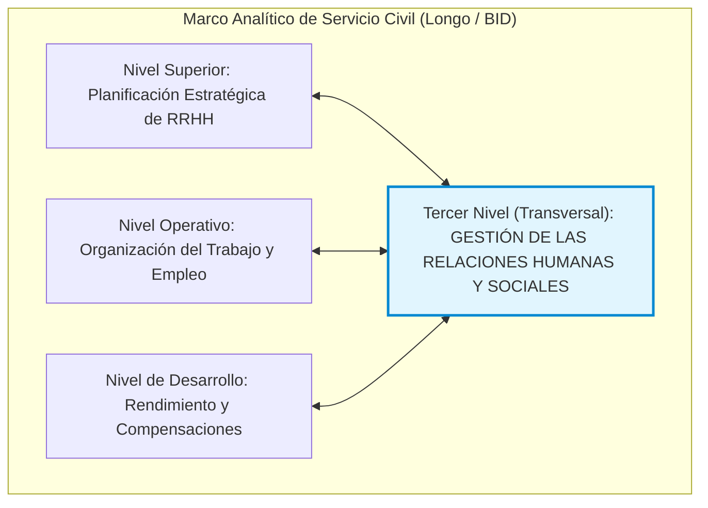
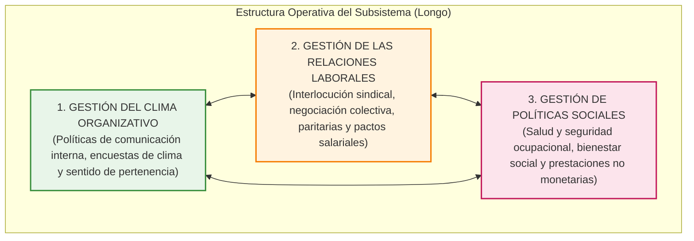

# 📘 Francisco Longo — Relaciones Humanas y Sociales en el Servicio Civil

* **Texto de Referencia**: *Marco Analítico para el Diagnóstico Institucional de Sistemas de Servicio Civil* (Págs. 42 a 45: "El Subsistema de Gestión de las Relaciones Humanas y Sociales", Banco Interamericano de Desarrollo — BID, 2002).
* **Autor**: Francisco Longo.
* **Unidad**: Unidad 3 — Relaciones Humanas y Sociales.
* **Asignatura**: Gestión de Recursos Humanos 3.

---

## 🧭 1. Ubicación Estructural y Concepto del Subsistema

Francisco Longo ubica el **Subsistema de Gestión de las Relaciones Humanas y Sociales** en el **tercer nivel (inferior)** de su célebre marco analítico para los sistemas de Servicio Civil. Lejos de constituir un apéndice aislado o meramente administrativo, este subsistema posee un **carácter eminentemente transversal**: interactúa y condiciona la viabilidad operativa de todos los restantes subsistemas del modelo (Planificación, Organización del Trabajo, Gestión del Empleo, Gestión del Rendimiento, Gestión de la Compensación y Gestión del Desarrollo).

---

## 👥 2. La Dimensión Colectiva (Eje Fundamental)

La clave analítica que define y delimita este subsistema respecto a otras áreas de personal radica en su **enfoque estrictamente colectivo**:

* **Qué NO es**: El subsistema **no se ocupa de la gestión de las relaciones interpersonales individuales** (por ejemplo, rencillas cotidianas, afinidades subjetivas o conflictos psicológicos entre dos empleados de un mismo escritorio). Esas situaciones corresponden al liderazgo directo de línea o a la supervisión operativa del puesto.
* **Qué SÍ es**: Gestiona las relaciones entre la organización pública y sus servidores cuando las políticas y prácticas de trabajo adquieren una **dimensión colectiva e institucional**. El interlocutor de la dirección superior no es el empleado individualmente considerado, sino la **totalidad de la plantilla laboral** o aquellos colectivos agrupados por identidades socioprofesionales, escalafonarias o sindicales compartidas.

> *"El objeto de este subsistema es estructurar, regular y canalizar los vínculos formales entre la administración pública y sus colectivos laborales, preservando la cohesión institucional, la equidad de trato y la paz social necesaria para la continuidad de los servicios del Estado."*

---

## 🏛️ 3. Los Tres Procesos Estructurales del Subsistema

Longo desagrega el subsistema en tres áreas o procesos de gestión articulados:

### 1. Gestión del Clima Organizativo y Comunicación Interna
* **Canales Formales Bidireccionales**:
  * *Comunicación Descendente*: Transmisión clara y oportuna desde la alta dirección hacia las bases de los objetivos estratégicos, cambios organizacionales, directivas y normativas.
  * *Comunicación Ascendente*: Dispositivos formales para captar las opiniones, reclamos, sugerencias y estados anímicos de los agentes de planta.
* **Ruptura del Paradigma Burocrático Tradicional**:
  * Tradicionalmente, las jerarquías intermedias del sector público acaparaban la información bajo el lema burocrático de *"la información es poder"*, administrándola discrecionalmente y generando rumores y distorsión.
  * El modelo de Longo exige sustituir ese secretismo por **plataformas digitales masivas, boletines oficiales, intranets y canales fluidos y transparentes**.
* **Sentido de Pertenencia e Implicación**: Medición periódica del clima laboral mediante encuestas estandarizadas y anónimas que evalúen la motivación, el compromiso ético y la satisfacción con el entorno físico e institucional.

### 2. Gestión de las Relaciones Laborales (RRLL)
* **Interlocución y Representación Colectiva**: Vínculos permanentes y formales con las entidades gremiales, colegios profesionales y comisiones internas de delegados.
* **Negociación Colectiva y Paritarias**: Construcción de consensos en torno a escalas salariales, nomencladores de funciones, condiciones generales de trabajo, licencias y regímenes disciplinarios.
* **Gestión Constructiva de Conflictos**: Abandono de la confrontación estéril para dar paso a mecanismos institucionales de prevención de huelgas y resolución concertada de controversias.

### 3. Gestión de Políticas Sociales y Salud Laboral
* **Higiene y Seguridad Ocupacional**: Prevención activa de enfermedades profesionales y accidentes de trabajo mediante la adecuación ergonómica y ambiental de las oficinas y dependencias públicas.
* **Servicios Sociales y Bienestar Laboral**: Prestaciones no dinerarias orientadas a mejorar la calidad de vida de los trabajadores y sus familias (comedores institucionales, guarderías, subsidios por escolaridad, asistencia médica preventiva, convenios recreativos y programas de apoyo psicológico).

---

## ⚠️ 4. Puntos Críticos y Patologías en el Sector Público

Longo realiza un diagnóstico crudo sobre las debilidades recurrentes en las administraciones públicas latinoamericanas:

1. **Déficit Crónico de Comunicación Interna**: Sensación generalizada en los empleados de que *"nadie escucha sus aportes"* y de que las resoluciones directivas se comunican a destiempo o con opacidad.
2. **Reactividad Extrema de la Gerencia Pública**: Las conducciones gubernamentales suelen carecer de una agenda proactiva de relaciones laborales; aguardan pasivamente a que estalle el conflicto gremial, la huelga o la toma de edificios para sentarse a negociar bajo coacción y apuro.
3. **Politización y Partidización**: Desdibujamiento de la frontera técnica entre la función patronal del Estado y la representación gremial. Cuando los funcionarios políticos ceden prebendas a los sindicatos con fines electorales, se dinamita la meritocracia y la equidad retributiva.
4. **Ausencia de Mecanismos de Mediación y Arbitraje**: Carencia de instancias neutrales y reglamentadas para dirimir controversias colectivas antes de la paralización de los servicios públicos esenciales.
5. **Sostenibilidad Fiscal de los Beneficios**: Concesión irresponsable de beneficios corporativos o prejubilaciones que no cuentan con respaldo financiero presupuestario, hipotecando las arcas fiscales de mediano plazo.

---

## 🎓 5. Énfasis de Cátedra y Clases Desgrabadas (Tips de Examen Oral / Parcial)

El análisis exhaustivo de las grabaciones de clase de las docentes María Laura Cabezas y Débora aporta los lineamientos específicos para la evaluación:

### ⚠️ Dinámica del Segundo Parcial (Examen Oral en Parejas)
> **Modalidad de Examen:** Las profesoras explicaron que el **Segundo Parcial es oral, virtual y sincrónico en parejas**, asignadas por orden alfabético estricto según el sistema Siu Guaraní.  
> La evaluación consta de **5 preguntas muy concretas y conceptuales por pareja**, disponiendo de un lapso de 10 a 12 minutos para responder con fluidez y vocabulario técnico.  
> **Contenido evaluado:** La **Unidad 3 ENTRA COMPLETA** (Longo, Chiavenato Cap. 11, 12 y 13, y Aquino).

### 📝 Consignas Clave Señaladas por las Docentes
1. **La Dimensión Colectiva en Longo (Pregunta Fija):**
   * Las docentes preguntan habitualmente: _"¿Qué gestiona el subsistema de relaciones humanas y sociales de Longo y qué diferencia existe con las relaciones interpersonales individuales?"_.
   * *Respuesta exigida:* Enfatizar que no resuelve peleas entre dos compañeros de trabajo; gestiona la relación formal e institucional de la entidad con la totalidad de los trabajadores o sus colectivos organizados.
2. **Los 3 Procesos Estructurales y el Clima Laboral:**
   * Detallar Clima Organizacional, Relaciones Laborales y Políticas Sociales. Explicar el cambio de paradigma comunicacional: erradicar la retención de datos por las jefaturas intermedias y garantizar la bidireccionalidad.

### 🌟 Ejemplos Reales Compartidos en Clase por las Profesoras
* **Caminatas y Bicicleteadas de Sábado (Gestión del Clima):**
  * La docente compartió el caso real de una gerenta de RRHH que ingresó a una organización con un clima laboral sumamente hostil y fragmentado. Para recuperar la confianza y distender las relaciones, implementó actividades recreativas no laborales (caminatas y bicicleteadas los días sábados invitando a los trabajadores con sus familias), logrando derribar barreras jerárquicas y transformar radicalmente el clima interno.
* **Proyectos Solidarios Interáreas (Horizontalidad):**
  * Se destacó el caso de proyectos solidarios donde empleadas de distintas jerarquías (abogadas de Legales, médicas y personal administrativo de maestranza) trabajaron a la par organizando colectas navideñas de juguetes e indumentaria, demostrando cómo las políticas sociales integradoras generan cohesión colectiva.
