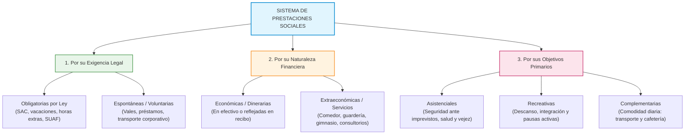
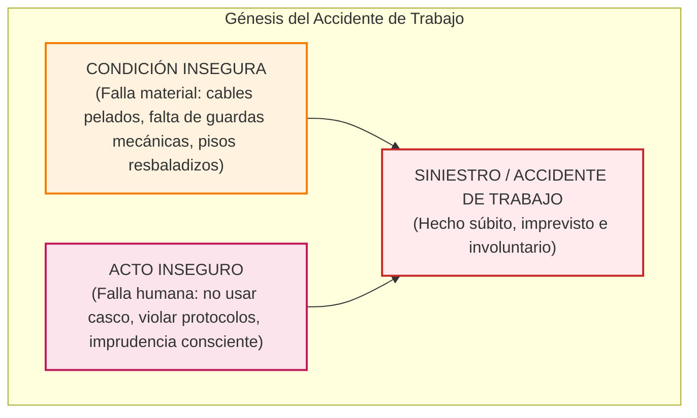
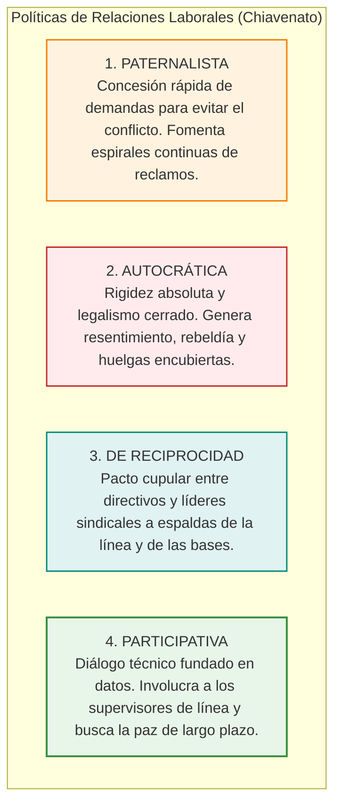

# 📘 Idalberto Chiavenato — Prestaciones Sociales, CVT y Relaciones Laborales

* **Texto de Referencia**: *Administración de Recursos Humanos: El capital humano de las organizaciones* (Capítulo 11: "Planes de prestaciones sociales", Capítulo 12: "Calidad de vida en el trabajo", y Capítulo 13: "Relaciones con los empleados", McGraw-Hill).
* **Autor**: Idalberto Chiavenato.
* **Unidad**: Unidad 3 — Relaciones Humanas y Sociales.
* **Asignatura**: Gestión de Recursos Humanos 3.

---

## 🎁 PARTE A. Capítulo 11: Planes de Prestaciones y Beneficios Sociales

### 1. Concepto y Origen Histórico
Las prestaciones sociales son conveniencias, servicios, facilidades y ventajas que las organizaciones otorgan a sus colaboradores para satisfacer necesidades personales y familiares que el sueldo base no cubre directamente:
* **Remuneración Directa**: Es el salario monetario pagado en estricta función del puesto específico que el trabajador ocupa en la estructura (varía según el cargo, la escala y la complejidad técnica).
* **Remuneración Indirecta**: Es el paquete integral de **prestaciones y beneficios sociales**, los cuales son comunes y equitativos para todos los miembros de la entidad, con independencia de su jerarquía o función.
* **Origen de los Planes Sociales**: Emergen como resultado de la confluencia de cuatro fuerzas:
  1. Las reivindicaciones legítimas de los sindicatos y las demandas del personal.
  2. Las exigencias impositivas y laborales del Estado (legislación de seguridad social).
  3. La competencia en el mercado de trabajo para atraer y retener talentos calificados.
  4. La búsqueda patronal de elevar la productividad y reducir la rotación (*turnover*) y el ausentismo.

---

### 2. Clasificación Estructural de las Prestaciones Sociales
Chiavenato sistematiza los beneficios en una matriz clasificada según tres criterios fundamentales:

| Criterio de Clasificación | Tipo de Prestación | Ejemplos Prácticos |
| :--- | :--- | :--- |
| **1. Por su Exigencia Legal** | **Obligatorias (Legales)** | Aguinaldo (Sueldo Anual Complementario), vacaciones anuales pagas, adicionales por antigüedad, asignaciones familiares (SUAF/Anses), horas extras, licencias por enfermedad/maternidad y provisión de vivienda en zonas inhóspitas o regímenes de seguridad. |
| | **Espontáneas (Voluntarias)** | Gratificaciones discrecionales, vales de compra de alimentos, préstamos a tasa subsidiada, coseguros médicos adicionales, becas universitarias y transporte especial. |
| **2. Por su Naturaleza Financiera** | **Económicas (Monetarias)** | Pagos directos en recibo de haberes: SAC, prima vacacional, fondos de jubilación complementaria y reintegro monetario de farmacia. |
| | **Extraeconómicas (En Especie)** | Servicios no dinerarios: servicio de comedor en planta, refrigerios gratuitos, estacionamiento privado, guardería infantil y asesoría jurídica/financiera. |
| **3. Por sus Objetivos** | **Asistenciales** | Cobertura médica y farmacéutica ampliada, pólizas colectivas de vida, traslados sanitarios y subsidios por sepelio. |
| | **Recreativas** | Convenios con clubes deportivos, campings, colonias de vacaciones para hijos de empleados, eventos de integración y pausas activas ergonómicas. |
| | **Complementarias** | Comedor subsidiado, combis o transporte corporativo, cajeros automáticos dentro de las instalaciones y salas de descanso. |

---

### 3. Modelos de Beneficios Flexibles y Fundamentos Teóricos
* **Beneficios Flexibles (*Cafeteria Plans*)**: Modalidad moderna donde el empleado administra su crédito social:
  * *Combo Estándar-Flexible*: Paquete obligatorio de ley más una suma de puntos para canjear por beneficios a elección.
  * *Planes Modulares*: Paquetes prediseñados según perfiles (ej. módulo joven sin hijos, módulo familiar, módulo directivo con auto y seguro premium).
  * *Efectivo Libre*: Asignación económica de libre disponibilidad (ej. bono de ayuda escolar).
  * *Nuevas Prestaciones (Trabajo Remoto)*: Pago de conectividad a Internet y provisión ergonómica de computadoras para *Home Office*.
* **Articulación con Maslow y Herzberg**:
  * Las prestaciones satisfacen necesidades fisiológicas y de seguridad en la pirámide de Maslow.
  * En la teoría de Frederick Herzberg, **las prestaciones son estrictamente Factores Higiénicos**: *su ausencia genera profunda insatisfacción y huelgas, pero su concesión por sí sola no genera motivación trascendente si el contenido del puesto no es desafiante*.
* **Principio de Responsabilidad Mutua**: La gratuidad absoluta fomenta actitudes paternalistas; los costos deben cofinanciarse para que el trabajador valore el servicio.

---

## 🛡️ PARTE B. Capítulo 12: Higiene, Seguridad y Calidad de Vida Laboral (CVT)

### 1. Calidad de Vida en el Trabajo (CVT) e Higiene Industrial
* **Concepto de CVT**: Enfoque holístico orientado a garantizar condiciones físicas, psicológicas, ambientales y sociales gratificantes dentro y fuera de la jornada de trabajo.
* **Higiene Laboral / Industrial**: Conjunto de normas técnicas de **carácter eminentemente preventivo** dirigidas a proteger la salud psicofísica del empleado frente a los riesgos presentes en el ambiente de trabajo:
  * *Riesgos Físicos*: Ruidos nocivos, vibraciones mecánicas, temperaturas extremas y radiaciones.
  * *Riesgos Químicos*: Inhalación de vapores tóxicos, gases industriales, polvos minerales o contacto dérmico con solventes, ácidos o formol.
  * *Riesgos Biológicos*: Exposición a bacterias, virus, hongos o patógenos (hospitales, laboratorios de análisis).

#### Factores Ambientales Críticos
* **Iluminación**: Debe ser adecuada a la agudeza visual de la tarea (directa, indirecta o semidirecta) para evitar fatiga ocular y cefaleas.
* **Ruido**: La exposición continuada a niveles superiores a 85 decibeles (db) lesiona irreversiblemente el aparato auditivo y provoca desconcentración y estrés.
* **Ergonomía**: Ciencia aplicada que rediseña las herramientas, puestos de trabajo, pantallas y mobiliario adaptándolos a las dimensiones anatómicas y fisiológicas del ser humano.

---

### 2. Seguridad Laboral y Accidentología

* **Diferencia Clave: Acto Inseguro vs. Condición Insegura**:
  * **Condición Insegura**: Falla física, estructural o mecánica del entorno laboral (ej. máquina sin dispositivo de parada de emergencia, iluminación insuficiente, pisos grasosos).
  * **Acto Inseguro**: Comportamiento imprudente, negligente o transgresor del propio operario (ej. negarse a colocarse guantes térmicos o faja lumbar, retirar protecciones mecánicas, distraerse durante maniobras peligrosas).

#### Clasificación de Accidentes según la Capacidad Laboral
1. **Accidente sin Ausencia**: Lesión menor (raspadura, corte leve) curada en enfermería; el agente retoma de inmediato sus funciones sin perder capacidad productiva.
2. **Accidente con Ausencia**:
   * **Incapacidad Temporal**: Conlleva baja médica transitoria (menor a un año); tras la rehabilitación, el trabajador se reincorpora a su mismo puesto sin secuelas.
   * **Incapacidad Parcial y Permanente**: Pérdida definitiva de alguna función o miembro (ej. pérdida de un ojo, reducción auditiva severa o amputación digital). Exige obligatoriamente la **readecuación formal de tareas** o reubicación funcional.
   * **Incapacidad Total y Permanente**: Inhabilitación laboral absoluta e irreversible. El trabajador pasa a retiro o jubilación por incapacidad dictaminada por juntas médicas oficiales (Comisión Médica 18 / Anses).
   * **Muerte**: Pérdida de la vida inmediata o diferida a consecuencia del siniestro.
* **Costos de Accidentes**: La regla de seguridad industrial señala que los **costos indirectos u ocultos** (horas de parada de línea, daño a equipos, desmotivación de la plantilla, peritajes) superan entre cuatro y diez veces los costos directos asegurados por la ART.

---

## 🤝 PARTE C. Capítulo 13: Relaciones con Empleados y Sindicatos

### 1. Movimientos Internos de Personal y Gestión de Conflictos
* **Movimientos Internos**:
  * *Transferencias*: Desplazamiento horizontal sin alteración de jerarquía ni salario.
  * *Ascensos*: Movimiento vertical con mayor estatus, responsabilidad y remuneración.
  * *Desvinculaciones*: Renuncias, jubilaciones, retiros voluntarios incentivados, despidos selectivos y programas de *outplacement* (asistencia para la reinserción externa).
* **Las Tres Causas Primarias del Conflicto Laboral**:
  1. *Diferenciación de metas*: Objetivos antagónicos entre departamentos (ej. Producción busca volumen a bajo costo; Calidad exige detener la línea por defectos).
  2. *Disputa por recursos escasos*: Rivalidad por presupuestos, oficinas, equipamiento informático o vehículos.
  3. *Interdependencia operativa*: Cuando el atraso de un área paraliza el trabajo de los demás sectores.
* **Las Cinco Reivindicaciones Gremiales**:
  1. *Legales* (cumplimiento de convenios, jornadas máximas y descansos).
  2. *Económicas* (recomposiciones salariales, escalafones y adicionales).
  3. *Físicas* (condiciones edilicias, ventilación y elementos de protección personal).
  4. *Sociales* (comedores, guarderías, subsidios familiares).
  5. *De representatividad* (reconocimiento formal de delegados e inclusión en comités mixtos).

---

### 2. Las Cuatro Políticas Patronales frente a los Sindicatos

* **Medios de Acción Sindical**: La huelga o paro, el trabajo a desgano (*tortuguismo*), la huelga de celo (aplicación hiperestricta del reglamento) y los piquetes informativos.
* **Medios de Acción Patronal**: El *lockout* (cierre patronal temporario) y las *listas negras* (práctica discriminatoria proscrita por las convenciones internacionales).

---

## 🎓 Énfasis de Cátedra y Clases Desgrabadas (Tips de Examen Oral / Parcial)

A partir de las desgrabaciones oficiales de las clases dictadas por las profesoras María Laura Cabezas y Débora, se destacan los siguientes núcleos de evaluación:

### ⚠️ Requisitos para el Segundo Parcial Oral
> **Formato de Evaluación:** El Segundo Parcial es un **examen oral sincrónico en parejas (por orden de lista)**. Las docentes realizan **5 preguntas puntuales por pareja**, exigiendo precisión técnica inmediata.  
> **Temario Evaluado:** La **Unidad 3 entra completa**, sin excepciones de autores.

### 📝 Preguntas Típicas de Examen en Chiavenato
1. **Diferencia entre Remuneración Directa e Indirecta:**
   * La directa retribuye las exigencias del cargo específico; la indirecta son los beneficios extendidos a toda la plantilla sin distinción.
2. **Clasificación Integral de Prestaciones con Ejemplos Reales:**
   * Desarrollar los 3 ejes: por exigencia (legales vs. voluntarias), por naturaleza (económicas vs. en especie) y por objetivos (asistenciales, recreativas y complementarias).
3. **Actos Inseguros vs. Condiciones Inseguras:**
   * Saber definir y contrastar ambos términos.
4. **Grados de Incapacidad y Readecuación de Tareas:**
   * Explicar qué ocurre cuando un trabajador sufre una incapacidad parcial permanente: la organización no puede despedirlo sin causa, debe someterlo a una junta médica y gestionar su *readecuación de tareas*.
5. **Las 4 Políticas Patronales frente al Sindicalismo:**
   * Describir Paternalista, Autocrática, De Reciprocidad y Participativa.

### 🏭 Ejemplos Reales Narrados en Clase por las Docentes
* **El Caso de Heladerías Grido (Condiciones Inseguras y Daño Físico):**
  * Las profesoras explicaron cómo una inspección de higiene y seguridad laboral detectó que los empleados que despachaban helado presentaban deformaciones articulares graves y principios de necrosis ("dedos negros") por el contacto constante con cubetas a temperaturas bajo cero. La empresa fue severamente sancionada y obligada a incorporar guantes térmicos especiales y rotación de puestos.
* **Manipulación de Químicos Tóxicos (Riesgos Químicos):**
  * Caso narrado por una alumna sobre el fraccionamiento de formol, ácidos y agua oxigenada de 30 volúmenes, que exige máscaras con filtro químico y reposición diaria de cartuchos descartables.
* **Uso de Fajas Lumbares (Prevención Ergonómica):**
  * Obligatoriedad en carnicerías, almacenes logísticos y obras de construcción para prevenir hernias de disco al levantar cargas pesadas.
* **Transporte y Estacionamiento Corporativo:**
  * La provisión de colectivos de traslado para plantas industriales situadas fuera del casco urbano y el estacionamiento cerrado como beneficio complementario altamente valorado.
