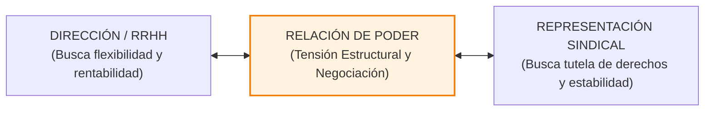
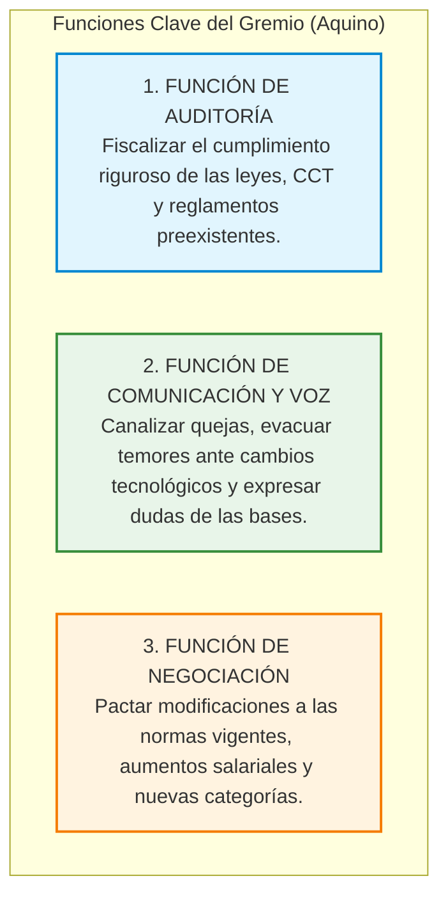

# 📘 Jorge Aquino y cols. — Relaciones Gremiales y Sindicales

* **Texto de Referencia**: *Recursos Humanos* (Capítulo 8: "Relaciones Gremiales", Ediciones Macchi).
* **Autores**: Jorge A. Aquino y equipo de colaboradores.
* **Unidad**: Unidad 3 — Relaciones Humanas y Sociales.
* **Asignatura**: Gestión de Recursos Humanos 3.

---

## 🧭 1. Concepto y Singularidades de las Relaciones Gremiales

Jorge Aquino define las **Relaciones Gremiales** como el conjunto sistemático de actividades, canales de comunicación y procesos de negociación que se desarrollan de manera formal entre los representantes de los trabajadores (comisiones internas, delegados, sindicatos) y los representantes de la dirección de la empresa, con el propósito expreso de **tramitar, canalizar y resolver reclamaciones, intereses contrapuestos y acuerdos recíprocos**.



### Las Cinco Características Singulares de la Relación Gremial
Para Aquino, la dinámica gremial se distingue de cualquier otra interacción empresarial por cinco rasgos distintivos:

1. **Trato Exclusivo entre Representantes**:
   * Quienes se sientan a la mesa de discusión negocian problemas que afectan a terceras personas.
   * Los representantes cuentan con una visión panorámica y estratégica de la empresa de la cual carece el empleado de base. Esto entraña un serio peligro: si los negociadores no comunican fluidamente las conclusiones a sus bases, pueden quedar aislados y perder representatividad.
2. **Proyección en el Tiempo de los Acuerdos**:
   * A diferencia de los contratos comerciales ordinarios que fenecen tras la entrega de una mercadería, los acuerdos laborales **perduran en el tiempo y trascienden a las personas físicas que los suscribieron**.
   * Aquino recomienda fijar con precisión **cláusulas de caducidad, plazos de vigencia y revisiones periódicas** para evitar que los convenios queden petrificados ante cambios tecnológicos.
3. **Relación de Poder y Tensión Estructural**:
   * La mesa gremial no es un espacio neutro de amistad, sino un escenario de confrontación de fuerzas.
   * La patronal procura resguardar la **flexibilidad operativa, el control de costos y la productividad**, mientras que la organización sindical persigue **restringir la discrecionalidad patronal, conquistar mejoras salariales y tutelar la estabilidad del empleo**.
4. **Resolución de Acuerdos sin Consenso Pleno**:
   * Rara vez se arriba a una votación unánime. Los acuerdos se sellan a través del principio de mayorías internas en el sindicato y el principio de autoridad ejecutiva en la empresa.
5. **Complicaciones Intersindicales e Intrasindicales**:
   * Las negociaciones se complejizan por disputas entre distintas centrales de trabajadores (ej. CGT vs. CTA), rivalidades entre gremios que disputan el encuadramiento de un mismo colectivo o fisuras internas entre la comisión de delegados de fábrica y la cúpula del sindicato central.

---

## 🏛️ 2. Las Tres Funciones Típicas de la Representación Gremial

Aquino describe las tres misiones funcionales que asume el delegado y dirigente sindical en la vida organizativa:



1. **Función de Auditoría**: Controlar que la empresa cumpla fielmente la legislación laboral, las cláusulas del Convenio Colectivo de Trabajo (CCT), las actas acuerdo previas y los usos y costumbres arraigados en la planta.
2. **Función de Comunicación y Voz**: Operar como órgano de resonancia legítimo de la fuerza laboral. Permite a la gerencia conocer el clima subterráneo de insatisfacción y disipar rumores ante reestructuraciones.
3. **Función de Negociación**: Actuar como parte formal facultada para crear nuevas regulaciones laborales, discutir paritarias salariales o convenir regímenes de productividad.

---

## ⚖️ 3. Los Dos Estilos de Gestión desde Recursos Humanos

El área de Recursos Humanos puede administrar los vínculos gremiales desde dos filosofías contrapuestas:

| Dimensión de Análisis | Política de Liderazgo (Personalista / Autoritario) | Política Legalista (Institucional / Participativo) |
| :--- | :--- | :--- |
| **Rol Asumido por RRHH** | **"Dueño del Tema"**: El gerente de RRHH monopoliza el trato gremial, desautorizando y despojando a los supervisores de línea de su autoridad sobre el personal. | **"Asesor y Consultor"**: RRHH capacita, respalda y acompaña a los jefes y gerentes de línea para que ellos mismos lideren y negocien con los delegados de su área. |
| **Modalidad de Trato** | Acuerdos verbales de palabra, casuísticos y cerrados "bajo la mesa". Se evita labrar actas escritas para no sentar precedentes. | Negociaciones abiertas, regladas y formales. Se labran actas minuciosas que aportan certidumbre y sientan precedentes transparentes. |
| **Sustento de la Decisión** | Subjetivo, basado en el carisma, la astucia o la presión coyuntural de quien negocia. | Objetivo, fundamentado en la ley laboral, los manuales técnicos de trabajo y datos estadísticos demostrables. |
| **Participación de la Línea** | Nula: Los supervisores se enteran de las concesiones patronales a posteriori, perdiendo autoridad frente a los obreros. | Activa: Los jefes de sector participan de las mesas paritarias y son corresponsables del cumplimiento del acuerdo. |

---

## 🧠 4. Cooperación Sindicato-Gerencia y Douglas McGregor

Aquino recurre a las formulaciones de Douglas McGregor para explicar el proceso de maduración psicológica e institucional en las relaciones de trabajo:

### Las Tres Etapas de Crecimiento Psicológico (McGregor)
1. **Etapa de Lucha y Sospecha**:
   * Hostilidad abierta y desconfianza militante. Cada parte concibe a la otra como un enemigo irreconciliable que busca su destrucción o sumisión total.
2. **Etapa de Negociación Fructuosa**:
   * Las partes abandonan el combate destructivo y pactan una especie de *neutralidad armada y constructiva*. Se acepta la legitimidad del adversario y se transige mediante concesiones mutuas.
3. **Etapa de Cooperación Genuina**:
   * Madurez institucional plena. Ambas partes comprenden que comparten un destino común y se unen para afrontar desafíos que amenazan la viabilidad y supervivencia de la empresa.

### 🛑 La Regla de Incompatibilidad Simultánea (Principio Fundamental)
Aquino formula una ley cardinal para la conducción de negociaciones gremiales:
* **La Negociación Colectiva (Distributiva)**: Es de naturaleza esencialmente competitiva y confrontativa. Las partes discuten cómo se reparte una cantidad finita de recursos ("repartir la torta": salarios, descansos, categorías). En ella se juega con *"las cartas pegadas al pecho"* (reserva de información).
* **La Cooperación (Integrativa)**: Es un esfuerzo conjunto sobre problemas compartidos en beneficio mutuo ("agrandar la torta": programas de seguridad e higiene, reducción de desperdicios, capacitación técnica, calidad). En ella se juega con *"las cartas descubiertas sobre la mesa"* (transparencia total).
* **El Principio de Incompatibilidad**: *Un mismo tema no puede ser objeto simultáneamente de negociación colectiva y de cooperación*. Si la empresa y el sindicato intentan cooperar en un asunto mientras negocian coercitivamente el mismo punto, la desconfianza destruirá el proyecto cooperativo.

---

## 📊 5. Modelo Gráfico de Diagnóstico y la "Doble Lealtad"

Para evaluar la salud del sistema sociolaboral, Aquino diseña un modelo topológico basado en tres componentes gráficos:
* **Círculos**: Representan los **Objetivos** (Objetivos estratégicos de la Dirección y Objetivos del Sindicato).
* **Rectángulos**: Representan los **Actores** (Dirección Empresarial, Sindicato, Colectivo de Trabajadores).
* **Líneas de Enlace**: Muestran la intensidad y solidez del vínculo (líneas de trazo discontinuo indican desconfianza; trazos múltiples indican cohesión y cercanía).

```
   [ Dirección ] ════════════ ( Objetivos Compartidos ) ════════════ [ Sindicato ]
         ║                                                                 ║
         ╚═══════════════════► [ TRABAJADORES ] ◄══════════════════════════╝
                               ( Doble Lealtad )
```

### El Ideal de la "Doble Lealtad"
Una gestión moderna de personal no debe buscar la destrucción del sindicato ni obligar al obrero a elegir entre su empresa y su gremio. El estado óptimo se alcanza cuando se consolida la **Doble Lealtad**: el trabajador siente un profundo compromiso de productividad con la empresa para la que trabaja, al mismo tiempo que se siente genuina y dignamente representado por su organización gremial.

---

## 🎓 Énfasis de Cátedra y Clases Desgrabadas (Tips de Examen Oral / Parcial)

El cuaderno de clases desgrabadas de las docentes María Laura Cabezas y Débora aporta especificaciones concretas sobre este autor:

### ⚠️ Requisitos para el Segundo Parcial Oral
> **Modalidad:** Examen oral virtual sincrónico en parejas (5 preguntas concretas, 10 minutos).  
> **Ubicación de Aquino en el Programa:** Las profesoras señalaron que los conceptos de Aquino sobre relaciones gremiales se toman como el marco integrador de la negociación colectiva, evaluando la articulación de RRHH con el factor sindical.

### 📝 Consignas Típicas de Examen en Aquino
1. **Las Tres Funciones de la Representación Gremial:**
   * Detallar y justificar: Auditoría (fiscalización normativa), Voz (canalización de inquietudes) y Negociación (creación/actualización de convenios).
2. **Rol de RRHH: ¿Dueño o Asesor?:**
   * Explicar por qué es perjudicial la política del "Dueño" (desautoriza a los supervisores de línea) y por qué se promueve la política del "Asesor" (capacitar a los mandos medios para que conduzcan la relación cotidiana con los delegados).
3. **La Regla de Incompatibilidad de Douglas McGregor:**
   * Saber explicar por qué un mismo tema no puede ser simultáneamente cooperativo y negociado, diferenciando "repartir la torta" de "agrandar la torta".
4. **El Concepto de Doble Lealtad:**
   * Definir por qué es el objetivo supremo de las relaciones laborales profesionales.
