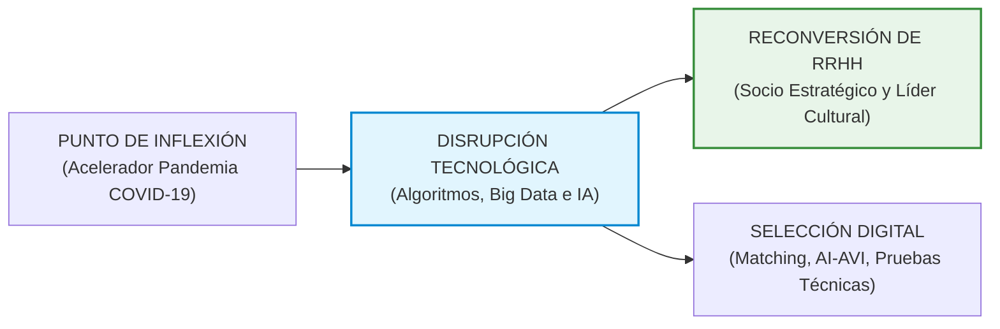
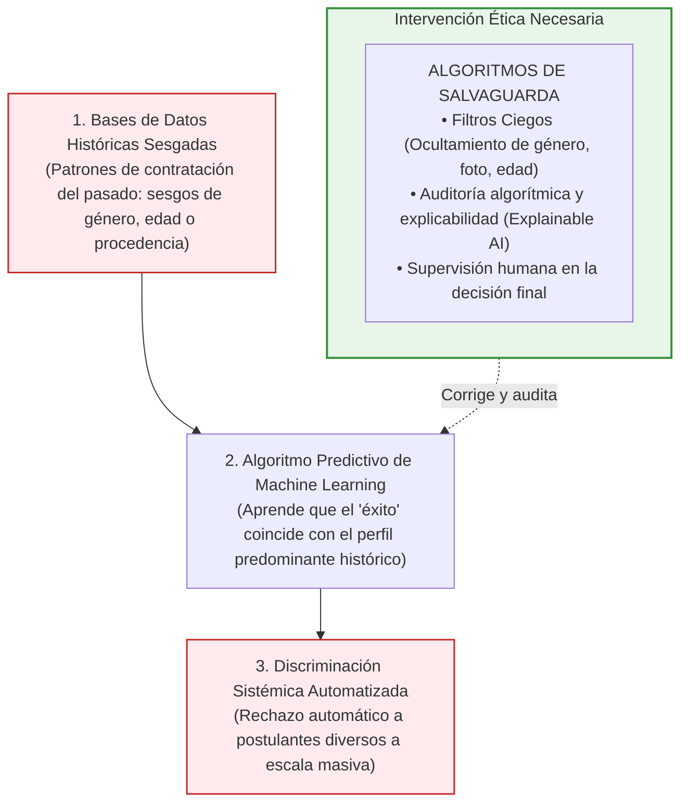

# 🤖 Peter Cappelli, Prasanna Tambe y Nikolai Rogovsky — Disrupción Tecnológica e Inteligencia Artificial en la Gestión del Talento

* **Texto de Referencia**: *Disrupción tecnológica en la gestión del talento: Inteligencia artificial y toma de decisiones en Recursos Humanos* (OIT / Wharton School, Universidad de Pensilvania).
* **Autores**: Peter Cappelli, Prasanna Tambe y Nikolai Rogovsky.
* **Unidad**: Unidad 4 — Perspectiva Actual de la Gestión de Recursos Humanos e Inteligencia Artificial.
* **Asignatura**: Gestión de Recursos Humanos 3.

---

## 🧭 1. Contexto Histórico y Punto de Inflexión: El Salto Tecnológico

La incorporación de la **Inteligencia Artificial (IA)** y el **Machine Learning (ML)** en la administración de personas no constituye una simple modernización de herramientas de oficina, sino una auténtica **disrupción de paradigma**:

* **Aceleración forzosa post-pandemia:** La crisis global del COVID-19 operó como un catalizador histórico y acelerador masivo. Obligó a las organizaciones a reestructurar de la noche a la mañana sus procesos de atracción, selección, capacitación y monitoreo del talento hacia entornos virtuales y remotos.
* **Mutación del rol de RRHH:** El departamento de personal abandona su condición tradicional de oficina burocrática, reactiva y transaccional para convertirse en el **arquitecto estratégico del cambio cultural y tecnológico**, liderando la reconversión de los puestos de trabajo y la alfabetización digital.

---

## 🛠️ 2. Las Cinco Técnicas Efectivas de Gestión del Talento Digital

Cappelli, Tambe y Rogovsky sistematizan cinco técnicas aplicadas en la frontera de la gestión del talento:

1. **Búsqueda y Reclutamiento en Línea (*Online Recruiting*):**
   * Empleo intensivo de plataformas digitales, motores de búsqueda semántica y redes profesionales (LinkedIn, GitHub) para rastrear y atraer perfiles especializados a escala global.
2. **Evaluación Basada en Habilidades (*Skill-Based Assessment*):**
   * Reemplazo de la confianza ciega en títulos formales por pruebas prácticas virtuales y plataformas de código o resolución de problemas en tiempo real, evaluando el desempeño efectivo del postulante.
3. **Evaluación de Ajuste Cultural (*Culture Fit*):**
   * Medición algorítmica de la compatibilidad entre los valores, estilos de trabajo y personalidad del candidato con la cultura interna y el clima del equipo de trabajo.
4. **Realidad Virtual (RV) y Realidad Aumentada (RA):**
   * Implementación de entornos inmersivos interactivos para la captación, evaluación y entrenamiento de perfiles en ocupaciones de alta complejidad técnica o riesgo físico.
5. **Selección Automatizada e Inteligencia Artificial:**
   * Filtrado automático de currículums mediante Procesamiento de Lenguaje Natural (NLP), clasificación con modelos predictivos (*Random Forest*), chatbots de primera interacción y programación automática de entrevistas.

---

## ⚖️ 3. El Dilema Ético: Sesgos Algorítmicos vs. Algoritmos de Salvaguarda

Uno de los aportes centrales del texto (y eje predilecto de evaluación de la cátedra) es el cuestionamiento a la supuesta "neutralidad matemática" de los algoritmos:

* **La Falacia de la Neutralidad Algorítmica:** La IA no piensa con ética propia; si un modelo de selección se entrena con los historiales de promociones de los últimos 20 años de una corporación (donde los puestos gerenciales fueron ocupados en un 90% por hombres de cierta etnia), el algoritmo asociará matemáticamente esas variables demográficas al "éxito laboral" y descartará automáticamente perfiles diversos.
* **Filtros Ciegos:** Configuración programada para eliminar del procesamiento datos como género, fotografía, edad, domicilio o estado civil, reduciendo prejuicios conscientes o inconscientes del evaluador humano.
* **Algoritmos de Salvaguarda:** Protocolos técnicos de control y auditoría algorítmica permanente que verifican que las decisiones automáticas no infrinjan leyes antidiscriminatorias, asegurando la *explicabilidad* del porqué un candidato fue calificado de cierta manera.

---

## 🕵️‍♂️ 4. Privacidad, Vigilancia Digital y "Sistemas Salvajes" (*Shadow IT*)

* **Vigilancia Digital y Derecho a la Intimidad:** El rastreo indiscriminado de la huella digital en redes sociales personales vulnera derechos fundamentales y genera desconfianza en los candidatos.
* **El Fenómeno de los "Sistemas Salvajes" (*Wild Systems / Shadow IT*):**
  * Se produce cuando los jefes de línea o los propios seleccionadores de personal perciben que el software oficial corporativo de RRHH es excesivamente rígido, lento o no comprende las particularidades de su sector.
  * Ante esa frustración, deciden eludir los canales oficiales y crean **herramientas paralelas no autorizadas** (planillas de Excel clandestinas, bases de datos informales en WhatsApp, reclutamiento por redes de contactos personales).
  * *Consecuencia grave:* Destruye la coherencia de la base de datos institucional, genera brechas de seguridad informática y desarticula las políticas formales de personal.

---

## 🤝 5. La Agenda de IA Centrada en el Ser Humano (IACH) y *Human-AI Teaming*

Cappelli y Rogovsky, en sintonía con la OIT, promueven superar la visión mecanicista que concibe a la tecnología como un reemplazo masivo del trabajador:

* **Agenda IACH (IA Centrada en el Ser Humano):** Postula que la tecnología debe diseñarse para complementar, potenciar y asistir las capacidades humanas, colocando el bienestar, la dignidad y el juicio crítico del colaborador en el centro de las decisiones.
* **Human-AI Teaming (Equipos Colaborativos Humano-IA):**
  * La inteligencia artificial asume el procesamiento masivo de datos, los cálculos combinatorios y el filtrado inicial repetitivo.
  * El profesional humano aporta la **empatía, la comprensión del contexto cultural, la negociación interpersonal y el discernimiento ético final**.
  * Se establece una *autonomía adaptativa*: en decisiones de bajo impacto (agendar un turno de entrevista) el sistema actúa automáticamente; en decisiones críticas (contratación definitiva, despido o evaluación disciplinaria), la decisión final queda en manos humanas.

---

## 🥽 6. Tecnologías Inmersivas: Realidad Virtual, Realidad Aumentada y Gemelos Digitales

* **Entornos de Alto Riesgo:** Aplicación en minería, plataformas petroleras, aeronáutica y cirugía médica.
* **Gemelos Digitales y Modelos Mentales:** Mapeo de los procesos decisorios de trabajadores expertos para proyectarlos en simuladores de Realidad Virtual. Permite a los ingresantes practicar maniobras críticas y equivocarse de forma segura, reduciendo costos de siniestralidad laboral y curvas de aprendizaje sin arriesgar vidas.

---

## 🎓 7. Énfasis de Cátedra y Clases Desgrabadas (Tips del Segundo Parcial Oral)

A partir del análisis de las clases dictadas por las profesoras María Laura Cabezas y Débora, se destacan los siguientes núcleos de evaluación para el Segundo Parcial:

### ⚠️ Estado del Texto en el Segundo Parcial (¡Lectura Obligatoria!)
> **Condición de Examen:** El texto de Cappelli, Tambe y Rogovsky **ENTRA DE FORMA OBLIGATORIA EN EL SEGUNDO PARCIAL ORAL**.  
> Las docentes confirmaron que de la Unidad 4 entran únicamente este texto y el de Bejerman (5 Tendencias), quedando el informe de la OIT reservado para el final.

### 🍔 El Caso McDonald's Analizado en Clase (Selección Automatizada)
Para ilustrar la aplicación real de la selección con IA, en clase se debatió el caso expuesto por una estudiante:
1. *Primer Filtro:* El postulante interactúa con un **chatbot (asistente virtual)** que valida requisitos excluyentes básicos (edad, disponibilidad horaria, residencia).
2. *Segundo Filtro:* El sistema somete al candidato a una **simulación digital interactiva de atención al cliente** para evaluar su velocidad de respuesta y resolución de quejas.
3. *Instancia Final:* Aquellos que superan las etapas algorítmicas son convocados a la **entrevista presencial definitiva con el gerente del local y el área de RRHH**, validando el modelo de *Human-AI Teaming*.

### 🏥 Caso Centro Quirúrgico de la UNCo (Realidad Aumentada vs. Gamificación)
Las profesoras dedicaron un bloque de clase a clarificar esta distinción técnica:
* **Gamificación:** Utilización de dinámicas y mecánicas de juego (puntos, insignias, niveles, avatares) para motivar el aprendizaje de competencias blandas o trabajo en equipo.
* **Realidad Aumentada y Virtual (Entornos Inmersivos):** Recreación sensorial exacta de entornos físicos reales. Como ejemplo local, las docentes citaron el **centro de simulación de cirugías complejas de la Universidad Nacional del Comahue (UNCo)**, donde los médicos en formación practican intervenciones de alto riesgo en réplicas virtuales antes de operar a pacientes reales.

### 📝 Preguntas Típicas de Examen Señaladas por las Docentes
1. *¿Por qué un algoritmo de IA puede amplificar la discriminación laboral?* Explicar el sesgo de las bases de datos de entrenamiento pasadas y la necesidad de algoritmos de salvaguarda.
2. *¿Qué es un "Sistema Salvaje" (Shadow IT) y qué perjuicio causa en RRHH?* Definir la creación de canales informales paralelos por frustración de los supervisores y la pérdida de gobernanza de datos.
3. *¿Qué sostiene la Agenda de IA Centrada en el Ser Humano (IACH)?* Complementar al talento humano sin sustituir el juicio ético de las personas.
