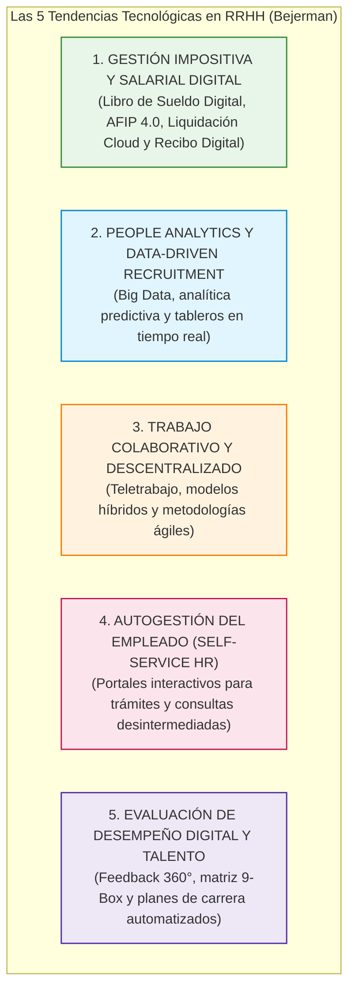

# 💻 Bejerman RRHH (Thomson Reuters) — Las 5 Tendencias Tecnológicas que Revolucionarán Recursos Humanos

* **Texto de Referencia**: *Las 5 tendencias tecnológicas para Recursos Humanos* (Informe Ejecutivo, Bejerman RRHH / Thomson Reuters).
* **Autor / Entidad**: Bejerman RRHH — Thomson Reuters.
* **Unidad**: Unidad 4 — Perspectiva Actual de la Gestión de Recursos Humanos e Inteligencia Artificial.
* **Asignatura**: Gestión de Recursos Humanos 3.

---

## 🧭 1. El Nuevo Rol de RRHH: De la Carga Burocrática al Socio Estratégico

El informe elaborado por **Bejerman RRHH (Thomson Reuters)** analiza la reconversión indispensable de las áreas de personal en la era de la transformación digital empresarial:

* **El punto de partida tradicional:** Históricamente, el departamento de Recursos Humanos consumía más del 70% de su presupuesto horario y humano en tareas estrictamente operativas, manuales y transaccionales (cálculo manual de jornales, pasaje de novedades salariales, archivo de legajos físicos en papel y atención constante de ventanilla para reclamos de liquidación).
* **La tecnología como habilitador del rol estratégico:** Las soluciones informáticas modernas operan como un **habilitador estructural** que automatiza las tareas rutinarias y burocráticas, permitiendo que RRHH se posicione como un **socio estratégico del negocio (*Strategic HR Business Partner*)**, liderando el cambio cultural, la fidelización del talento y la competitividad organizacional.

---

## 🚀 2. Las Cinco Tendencias Tecnológicas Clave

### 1. Gestión Impositiva y Salarial Digital (Libro de Sueldo Digital y Liquidación Cloud)
* **Integración Directa con Organismos Tributarios (AFIP/ARCA 4.0):**
  * La adopción del **Libro de Sueldo Digital** en Argentina permite la interoperabilidad directa mediante clave fiscal. La liquidación de haberes efectuada en el software genera automáticamente las declaraciones juradas de aportes y contribuciones patronales (Formulario 931).
  * Erradica la duplicación de carga y minimiza a cero las inconsistencias registrales, eliminando contingencias por multas administrativas e intereses punitorios.
* **Liquidación Cloud Paramétrica Multi-Convenio:**
  * Motores de cálculo en la nube capaces de liquidar simultáneamente múltiples Convenios Colectivos de Trabajo (CCT), con escalas salariales variables, adicionales por nocturnidad, insalubridad y horas extras complejas.
  * Automatización precisa de las deducciones y alícuotas progresivas del **Impuesto a las Ganancias (4ª categoría)**, adaptándose de forma inmediata a los cambios legislativos mediante el procesamiento del Formulario 572 (SiRADIG).
* **Recibo de Sueldo Digital y Firma con Token:**
  * Implementación del recibo de sueldo electrónico firmado digitalmente mediante **Token respaldado por el RENAPER**, con plena validez legal probatoria y trazabilidad jurídica.

### 2. People Analytics y Reclutamiento Basado en Datos (*Data-Driven Recruitment*)
* **De la Intuición a la Evidencia:** Sustitución de la "corazonada" subjetiva del reclutador por modelos analíticos basados en *Big Data*.
* **Filtrado Predictivo:** Cálculo de puntuaciones algorítmicas de adecuación al perfil del cargo a partir de trayectorias formativas, competencias demostrables y patrones estadísticos de permanencia.
* **Tableros de Control (KPIs) en Tiempo Real:** Métricas dinámicas que reemplazan las planillas estáticas:
  * Tasa de rotación temprana (*early turnover*) y retención de talentos clave.
  * Relación de costo entre horas extras acumuladas versus contratación de nueva dotación.
  * Curvas de ausentismo laboral justificado e injustificado desglosadas por turno y sector.
  * Retorno sobre la inversión (ROI) en programas de capacitación.

### 3. Trabajo Colaborativo y Descentralizado (Teletrabajo y Esquemas Híbridos)
* **Entornos Distribuidos:** Plataformas colaborativas en la nube que permiten a equipos interdisciplinarios trabajar en torno a proyectos sin requerir supervisión física presencial constante.
* **Consolidación Post-Pandemia:** El informe destaca que tras el confinamiento obligatorio, **entre el 50% y el 60% de las empresas mantuvieron esquemas híbridos o remotos permanentes**, exigiendo a RRHH redefinir los esquemas de compensación, ergonomía en el hogar y evaluación por objetivos alcanzados.

### 4. Autogestión del Empleado (*Self-Service HR*)
* **Desintermediación Operativa:** Portales web y aplicaciones móviles donde el trabajador gestiona de forma autónoma sus requerimientos sin depender de una ventanilla de atención:
  * Solicitud y autorización electrónica de vacaciones y días de descanso.
  * Notificación de inasistencias y carga digital de certificados médicos.
  * Descarga y firma digital de recibos de sueldo las 24 horas.
  * Consulta en tiempo real de su legajo personal y créditos sociales.
* **Impacto en RRHH:** Libera al personal de recursos humanos del "papeleo" administrativo, permitiéndole abocarse a la gestión del clima, la capacitación y la retención del talento.

### 5. Evaluación de Desempeño Digital y Mapeo del Talento
* **Feedback Continuo Multi-Fuente:** Reemplazo de la tradicional entrevista anual por ciclos continuos de evaluación (90°, 180° y 360°), midiendo el rendimiento individual y la contribución grupal.
* **Matriz 9-Box (Desempeño vs. Potencial):** Mapeo automatizado de los colaboradores para identificar a los de alto potencial (*HiPo*) y diseñar cuadros de reemplazo y planes de carrera para puestos gerenciales críticos.

---

## 🏛️ 3. Los Tres Pilares de Aporte de Valor al Negocio

La inversión en tecnología de RRHH se fundamenta ante el directorio corporativo en tres pilares de retorno:

1. **Gestión Estratégica del Talento:** Atraer, motivar y retener a los mejores perfiles apoyándose en métricas objetivas.
2. **Eficiencia Operativa:** Eliminación del archivo físico en papel, reducción drástica de tiempos de respuesta y simplificación de circuitos.
3. **Cumplimiento Normativo y Blindaje Jurídico:** Garantía de apego a la legislación laboral, previsional e impositiva vigente, previniendo litigios y contingencias fiscales.

---

## 🎓 4. Énfasis de Cátedra y Clases Desgrabadas (Tips del Segundo Parcial Oral)

A partir de las desgrabaciones oficiales de las clases de las profesoras María Laura Cabezas y Débora, se destacan los siguientes núcleos de evaluación para el Segundo Parcial:

### ⚠️ Estado del Texto en el Segundo Parcial (¡Lectura Obligatoria!)
> **Condición de Examen:** El informe de Bejerman sobre las 5 Tendencias Tecnológicas **ENTRA OBLIGATORIAMENTE EN EL SEGUNDO PARCIAL ORAL**.  
> Las docentes confirmaron que es uno de los dos textos evaluados de la Unidad 4.

### 🤫 La Confidencialidad Salarial y la Muerte del "Chisme de Pasillo"
La docente María Laura Cabezas remarcó con énfasis un aspecto humano y legal del Recibo de Sueldo Digital:
* **El antiguo vicio administrativo:** Antiguamente, en las empresas y oficinas públicas se imprimían grandes planillas salariales que pasaban de mano en mano entre escritorios para que los empleados firmaran la recepción, exponiendo públicamente cuánto cobraba cada uno y desatando el *"chisme salarial"*, envidias y conflictos internos.
* **El Recibo Digital como Garantía de Privacidad:** Con la autogestión y el recibo digital con Token, el salario se vuelve **estrictamente confidencial**. El trabajador accede a su información de forma privada e inviolable.
* **Regla Legal Estricta de la Docente:** La información salarial es un **dato personal sensible y privado**. El área de Recursos Humanos tiene **prohibición absoluta** de entregar recibos o divulgar datos salariales a terceros (ni a parientes, cónyuges o jefes de otras áreas), **excepto cuando medie una orden expresa de un oficio judicial emitido por un juez competente**.

### 📝 Consignas Típicas de Examen Señaladas por las Docentes
1. *Mencionar y explicar las 5 tendencias tecnológicas que revolucionan RRHH.*
2. *¿Cómo impacta el Libro de Sueldo Digital y la Liquidación Cloud en la mitigación de riesgos fiscales?*
3. *¿Por qué People Analytics reemplaza la "corazonada" del seleccionador tradicional?*
4. *¿Qué ventajas aporta la Autogestión del Empleado tanto para el trabajador como para el departamento de RRHH?*
