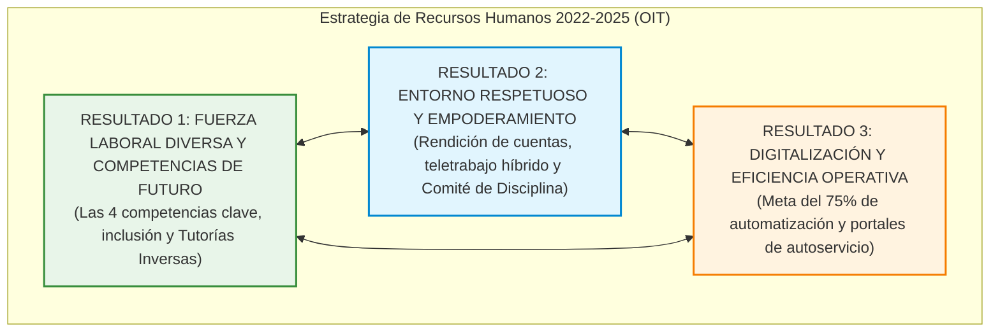
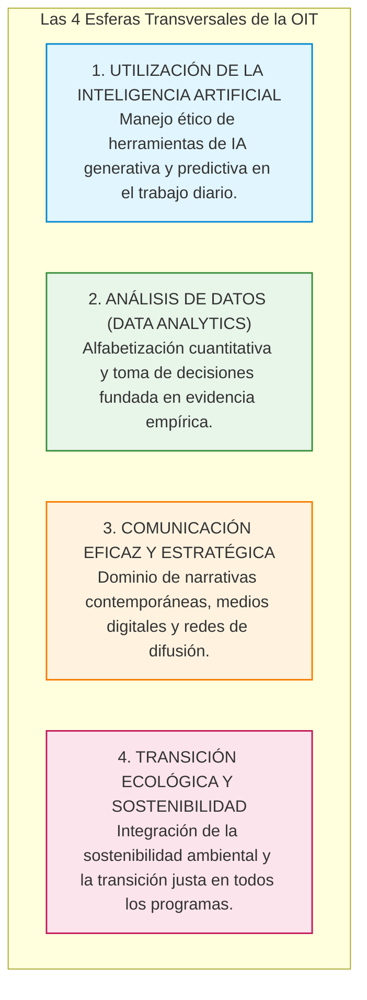

# 🏛️ Organización Internacional del Trabajo (OIT) — Estrategia de Recursos Humanos 2022-2025: Diversidad, Rendición de Cuentas y Respeto

* **Texto de Referencia**: *Estrategia de Recursos Humanos 2022-2025: Diversidad, Rendición de Cuentas y Respeto* (Ginebra, 343.ª reunión del Consejo de Administración de la OIT).
* **Entidad Emisora**: Organización Internacional del Trabajo (OIT).
* **Unidad**: Unidad 4 — Perspectiva Actual de la Gestión de Recursos Humanos e Inteligencia Artificial.
* **Asignatura**: Gestión de Recursos Humanos 3.

---

## 🧭 1. Marco Institucional y Propósito Estratégico

Aprobada por el **Consejo de Administración de la OIT en su 343.ª reunión**, la *Estrategia de Recursos Humanos 2022-2025* constituye la hoja de ruta institucional diseñada para transformar la gestión de personas en un organismo internacional multilateral, garantizando los más altos estándares de **competencia técnica, eficiencia operativa e integridad ética**.

El documento articula los desafíos tecnológicos, demográficos y sociales contemporáneos a través de **tres resultados estratégicos interdependientes**:

---

## 🌐 2. Resultado 1: Fuerza Laboral Diversa y Competencias para el Futuro

### A. Las Cuatro Esferas Prioritarias Transversales de Competencias
A partir de relevamientos y análisis de brechas de habilidades (*skill-gap analysis*), la OIT identificó cuatro competencias obligatorias y transversales que todo su personal debe dominar, con independencia de su especialidad técnica:

### B. Diversidad, Equidad e Inclusión Estructural
* **Equilibrio de Género y Representación Geográfica:** Medidas proactivas para garantizar paridad de género en puestos de conducción directiva y cuotas de contratación para países subrepresentados o no representados.
* **Inclusión de Personas con Discapacidad:** Financiamiento específico para pasantías rentadas y capacitación sistemática a los comités de concurso sobre la implementación de **ajustes razonables** en los puestos de trabajo.
* **Tutorías Inversas (*Reverse Mentoring*) y Diálogo Intergeneracional:**
  * Metodología de desarrollo profesional donde los funcionarios más jóvenes o recién ingresados asesoran y capacitan a directivos sénior en competencias digitales, IA y metodologías ágiles.
  * Rompe las jerarquías verticales rígidas, fomenta una cultura colaborativa horizontal y acelera la transformación digital sin resistencias generacionales.

---

## 🛡️ 3. Resultado 2: Entorno Respetuoso y Propicio al Empoderamiento

### A. Rendición de Cuentas (*Accountability*) y Evaluación del Desempeño
* La evaluación del rendimiento individual se formaliza a través del **Comité de Informes**.
* Aplica un principio estricto de **gestión de consecuencias**: acompañamiento formativo ante brechas corregibles y desvinculación formal ante rendimientos deficientes crónicos.

### B. Trabajo Flexible y Teletrabajo Híbrido
* **Marco Normativo Híbrido:** Establece un equilibrio entre el trabajo remoto y la presencialidad obligatoria para resguardar la cohesión cultural.
* **Métricas Institucionales de Impacto:**
  * El teletrabajo representa el **16% del tiempo global de trabajo** en la Organización (22% en la sede central de Ginebra y 13% en representaciones regionales).
  * El **82% del personal** manifestó un impacto positivo directo en la conciliación entre vida personal, familiar y profesional.
* **Salud Mental y Derecho a la Desconexión:** Protocolos para prevenir el agotamiento digital (*burnout*) y el aislamiento profesional.

### C. Lugares de Trabajo Éticos y Tolerancia Cero
* Política de tolerancia cero frente al acoso laboral, acoso sexual, discriminación o represalias.
* Fortalecimiento del **Comité de Disciplina**: publicación de resúmenes periódicos transparentes de los casos investigados y de las sanciones aplicadas, reforzando la confianza en los canales formales de denuncia.

---

## ⚙️ 4. Resultado 3: Digitalización y Eficiencia Operativa

* **Metas de Automatización de Procesos:**
  * **69% de procesos digitalizados** al cierre del ejercicio 2024.
  * **Meta vinculante del 75%** para finales de 2025.
* **Portales de Autoservicio y Descentralización:**
  * Supresión definitiva del expediente en papel mediante el archivo digital único.
  * Plataformas de autogestión de reembolsos médicos (sistema SHIF), monitoreo de ausentismo en tiempo real y solicitud digital de licencias.

---

## 🎓 5. Énfasis de Cátedra y Clases Desgrabadas (Tips para el Examen Final)

El análisis del cuaderno de clases desgrabadas de las docentes María Laura Cabezas y Débora aporta una aclaración indispensable sobre este texto:

### ⚠️ Estado del Texto en el Calendario Académico (¡Aviso Vital!)
> **Condición de Examen:** Las profesoras aclararon de manera taxativa que el informe de la OIT (Estrategia 2022-2025) **NO INGRESA EN EL SEGUNDO PARCIAL ORAL**.  
> **Destino Académico:** Este texto entra **EXCLUSIVAMENTE EN LA MESA DEL EXAMEN FINAL**.  
> Por tanto, los alumnos no deben estudiar este informe para el parcial oral en parejas, pero sí deben dominarlo minuciosamente para rendir la materia en condición regular o libre en el examen final.

### 📝 Consignas Clave para el Examen Final
1. **Las Cuatro Esferas Transversales de Competencias:** Desarrollar en detalle: 1) Utilización de IA, 2) Analítica de Datos, 3) Comunicación Eficaz y 4) Transición Ecológica y Sostenibilidad.
2. **El Concepto de Tutoría Inversa (*Reverse Mentoring*):** Explicar cómo los empleados jóvenes capacitan a los mandos sénior en pensamiento digital y cómo esto dinamiza la cultura corporativa.
3. **Métricas y Regulación del Teletrabajo Híbrido:** Citar la cifra del 16% de tiempo global y el 82% de impacto positivo en la conciliación vida-trabajo.
4. **Rendición de Cuentas y Comités Éticos:** Explicar el rol del Comité de Informes y la publicidad de sanciones del Comité de Disciplina.
